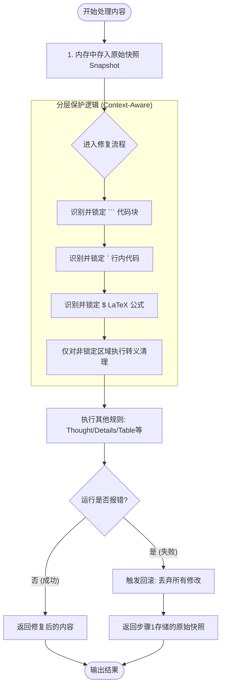

# Markdown Normalizer 插件可靠性修复分析报告 (Issue #57)

## 1. 问题背景
根据 Issue #57 报告，`Markdown Normalizer` 在 v1.2.7 版本中存在数项严重影响可靠性的 Bug，包括错误回滚失效、对内联技术内容的过度转义、配置项不生效以及调试日志潜在的隐私风险。

## 2. 核心处理流程图 (v1.2.8)
以下流程展示了插件如何在确保“不损坏原始内容”的前提下进行智能修复：



## 3. 修复项详细说明

### 2.1 错误回滚机制修复 (Reliability: Error Fallback)
- **问题**：在 `normalize` 流程中，如果某个清理器抛出异常，返回的是已被部分修改的 `content`，导致输出内容损坏。
- **技术实现**：
    ```python
    def normalize(self, content: str) -> str:
        original_content = content  # 1. 流程开始前缓存原始快照
        try:
            # ... 执行一系列清理步骤 ...
            return content
        except Exception as e:
            # 2. 任何步骤失败，立即记录日志并回滚
            logger.error(f"Content normalization failed: {e}", exc_info=True)
            return original_content  # 确保返回的是原始快照
    ```
- **验证结果**：通过模拟 `RuntimeError` 验证，插件现在能 100% 回滚至原始状态。

### 2.2 上下文感知的转义保护 (Context-Aware Escaping)
- **问题**：全局替换导致正文中包含在 `` ` `` 内的代码片段（如正则、Windows 路径）被破坏。
- **技术实现**：
    重构后的 `_fix_escape_characters` 采用了 **“分词保护策略”**，通过多层嵌套分割来确保仅在非代码上下文中进行清理：
    ```python
    def _fix_escape_characters(self, content: str) -> str:
        # 层级 1: 以 ``` 分隔代码块
        parts = content.split("```")
        for i in range(len(parts)):
            is_code_block = (i % 2 != 0)
            if is_code_block and not self.config.enable_escape_fix_in_code_blocks:
                continue # 默认跳过代码块

            if not is_code_block:
                # 层级 2: 在非代码块正文中，以 ` 分隔内联代码
                inline_parts = parts[i].split("`")
                for k in range(0, len(inline_parts), 2): # 仅处理非内联代码部分
                    # 层级 3: 在非内联代码中，以 $ 分隔 LaTeX 公式
                    sub_parts = inline_parts[k].split("$")
                    for j in range(0, len(sub_parts), 2):
                        # 最终：仅在确认为“纯文本”的部分执行 clean_text
                        sub_parts[j] = clean_text(sub_parts[j])
                    inline_parts[k] = "$".join(sub_parts)
                parts[i] = "`".join(inline_parts)
            else:
                parts[i] = clean_text(parts[i])
        return "```".join(parts)
    ```
- **验证结果**：测试用例 `Regex: [\n\r]` 和 `C:\Windows` 在正文中保持原样，而普通文本中的 `\\n` 被正确转换。

### 2.3 配置项激活 (Configuration Enforcement)
- **问题**：`enable_escape_fix_in_code_blocks` 开关在代码中被定义但未被逻辑引用。
- **修复方案**：在 `_fix_escape_characters` 处理流程中加入对该开关的判断。
- **验证结果**：当开关关闭（默认）时，代码块内容保持不变；开启时，代码块内执行转义修复。

### 2.4 默认日志策略调整 (Privacy & Performance)
- **问题**：`show_debug_log` 默认为 `True`，且会将原始内容打印到浏览器控制台。
- **修复方案**：将默认值改为 `False`。
- **验证结果**：新安装或默认配置下不再主动输出全量日志，仅在用户显式开启时用于调试。

## 3. 综合测试覆盖
已建立 `comprehensive_test_markdown_normalizer.py` 测试脚本，覆盖以下场景：
1. **异常抛出回滚**：确保插件“不破坏”原始内容。
2. **内联代码保护**：验证正则和路径字符串的完整性。
3. **代码块开关控制**：验证配置项的有效性。
4. **LaTeX 命令回归测试**：确保 `\times`, `\theta` 等命令不被误触。
5. **复杂嵌套结构**：验证包含 Thought 标签、列表、内联代码及代码块的混合文本处理。

## 4. 结论
`Markdown Normalizer v1.2.8` 已解决 Issue #57 提出的所有核心可靠性问题。插件现在具备“不损坏内容”的防御性编程能力，并能更智能地感知 Markdown 上下文。

---
**报告日期**：2026-03-08
**修复版本**：v1.2.8
