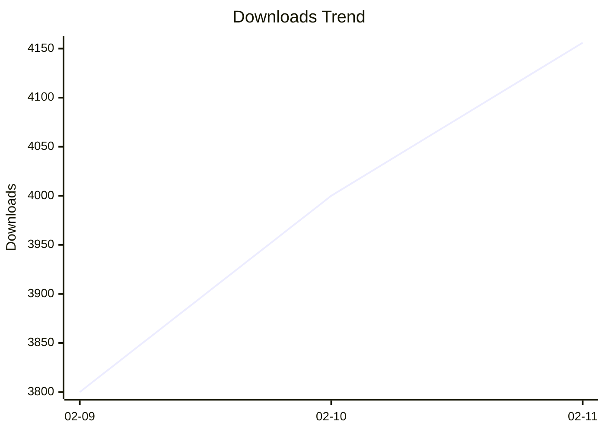

# 📊 OpenWebUI Community Stats Report

> 📅 Updated: 2026-02-11 12:09

### 📈 增长趋势 (14天)

## 📈 Overview

| Metric | Value | Growth (24h) |
|------|------|:---:|
| 📝 Total Posts | 22 | - |
| ⬇️ Total Downloads | 4156 | **+156** 🚀 |
| 👁️ Total Views | 45911 | **+1911** 🚀 |
| 👍 Total Upvotes | 231 | **+11** 🚀 |
| 💾 Total Saves | 274 | - |
| 💬 Total Comments | 55 | - |
| ⭐ Author Points | 271 | - |
| 👥 Followers | 220 | **+2** 🚀 |

## 📂 By Type

- **post**: 3
- **filter**: 4
- **pipe**: 1
- **action**: 12
- **prompt**: 1
- **review**: 1

## 📋 Posts List

| Rank | Title | Type | Version | Downloads | Views | Upvotes | Saves | Updated |
|:---:|------|:---:|:---:|:---:|:---:|:---:|:---:|:---:|
| 1 | [Smart Mind Map](https://openwebui.com/posts/turn_any_text_into_beautiful_mind_maps_3094c59a) | action | 0.9.2 | 954 | 8385 | 22 | 50 | 2026-01-29 |
| 2 | [Smart Infographic](https://openwebui.com/posts/smart_infographic_ad6f0c7f) | action | 1.5.0 | 707 | 6701 | 24 | 34 | 2026-01-31 |
| 3 | [Export to Word Enhanced](https://openwebui.com/posts/export_to_word_enhanced_formatting_fca6a315) | action | 0.4.4 | 383 | 3026 | 14 | 26 | 2026-02-07 |
| 4 | [Async Context Compression](https://openwebui.com/posts/async_context_compression_b1655bc8) | filter | 1.2.2 | 363 | 3754 | 14 | 34 | 2026-01-29 |
| 5 | [Export to Excel](https://openwebui.com/posts/export_mulit_table_to_excel_244b8f9d) | action | 0.3.7 | 342 | 1671 | 7 | 6 | 2026-02-10 |
| 6 | [Markdown Normalizer](https://openwebui.com/posts/markdown_normalizer_baaa8732) | filter | 1.2.4 | 341 | 4711 | 17 | 30 | 2026-01-29 |
| 7 | [Flash Card](https://openwebui.com/posts/flash_card_65a2ea8f) | action | 0.2.4 | 226 | 3387 | 13 | 14 | 2026-01-29 |
| 8 | [AI Task Instruction Generator](https://openwebui.com/posts/ai_task_instruction_generator_9bab8b37) | prompt |  | 200 | 2778 | 9 | 6 | 2026-01-28 |
| 9 | [Deep Dive](https://openwebui.com/posts/deep_dive_c0b846e4) | action | 1.0.0 | 147 | 1250 | 6 | 11 | 2026-01-08 |
| 10 | [导出为Word增强版](https://openwebui.com/posts/导出为_word_支持公式流程图表格和代码块_8a6306c0) | action | 0.4.4 | 128 | 2219 | 13 | 7 | 2026-02-07 |
| 11 | [GitHub Copilot Official SDK Pipe](https://openwebui.com/posts/github_copilot_official_sdk_pipe_ce96f7b4) | pipe | 0.6.2 | 107 | 2403 | 14 | 9 | 2026-02-10 |
| 12 | [📂 Folder Memory – Auto-Evolving Project Context](https://openwebui.com/posts/folder_memory_auto_evolving_project_context_4a9875b2) | filter | 0.1.0 | 61 | 1318 | 6 | 8 | 2026-01-20 |
| 13 | [智能信息图](https://openwebui.com/posts/智能信息图_e04a48ff) | action | 1.5.0 | 58 | 1065 | 10 | 1 | 2026-01-29 |
| 14 | [思维导图](https://openwebui.com/posts/智能生成交互式思维导图帮助用户可视化知识_8d4b097b) | action | 0.9.2 | 39 | 589 | 6 | 2 | 2026-01-29 |
| 15 | [异步上下文压缩](https://openwebui.com/posts/异步上下文压缩_5c0617cb) | action | 1.2.2 | 33 | 669 | 7 | 5 | 2026-01-29 |
| 16 | [闪记卡 (Flash Card)](https://openwebui.com/posts/闪记卡生成插件_4a31eac3) | action | 0.2.4 | 27 | 690 | 8 | 1 | 2026-01-29 |
| 17 | [精读](https://openwebui.com/posts/精读_99830b0f) | action | 1.0.0 | 24 | 444 | 5 | 1 | 2026-01-08 |
| 18 | [GitHub Copilot SDK Files Filter](https://openwebui.com/posts/github_copilot_sdk_files_filter_403a62ee) | filter | 0.1.2 | 16 | 851 | 3 | 0 | 2026-02-10 |
| 19 | [🚀 GitHub Copilot SDK Pipe: AI That Executes, Not Just Talks](https://openwebui.com/posts/github_copilot_sdk_for_openwebui_elevate_your_ai_t_a140f293) | post |  | 0 | 276 | 5 | 0 | 2026-02-10 |
| 20 | [🚀 Open WebUI Prompt Plus: AI-Powered Prompt Manager](https://openwebui.com/posts/open_webui_prompt_plus_ai_powered_prompt_manager_s_15fa060e) | post |  | 0 | 1525 | 12 | 19 | 2026-01-29 |
| 21 | [Review of Claude Haiku 4.5](https://openwebui.com/posts/review_of_claude_haiku_45_41b0db39) | review |  | 0 | 161 | 2 | 0 | 2026-01-14 |
| 22 | [ 🛠️ Debug Open WebUI Plugins in Your Browser](https://openwebui.com/posts/debug_open_webui_plugins_in_your_browser_81bf7960) | post |  | 0 | 1421 | 14 | 10 | 2026-01-10 |
