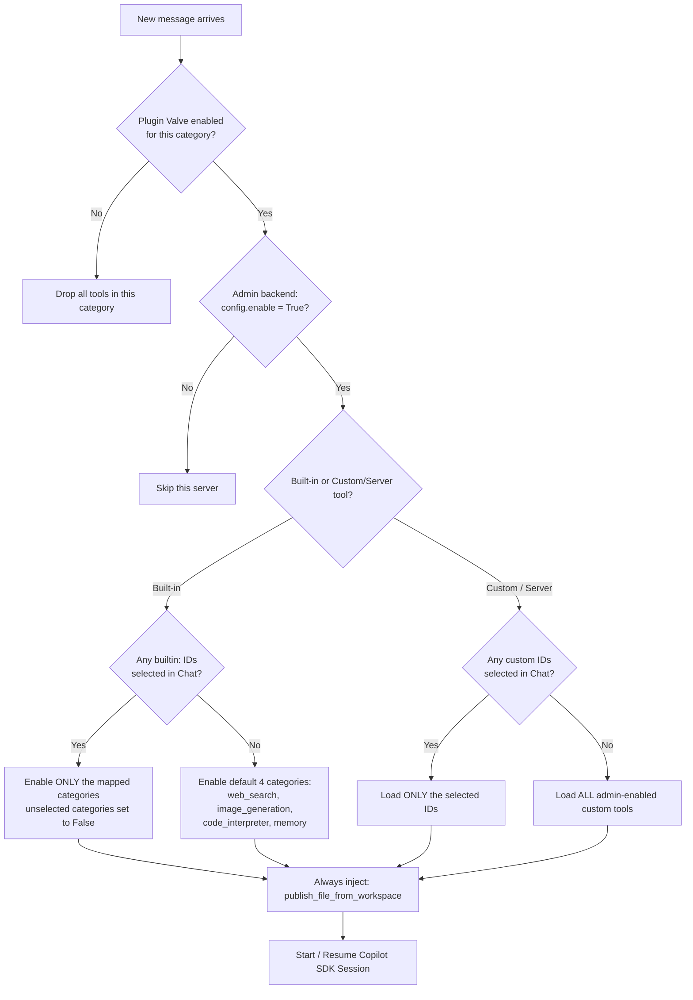

# GitHub Copilot SDK Tool Filtering Logic Documentation

## Overview

The tool filtering logic ensures that changes made in the **OpenWebUI admin panel take effect on the very next chat message** — no restart or cache flush required. The design balances three goals: administrator control, user autonomy, and built-in feature availability.

## Priority Hierarchy

Filtering is applied top-to-bottom. A higher layer can fully block a lower one:

| Priority | Layer | Controls |
|---|---|---|
| 1 (Highest) | **Plugin Valve toggles** | `ENABLE_OPENWEBUI_TOOLS`, `ENABLE_MCP_SERVER`, `ENABLE_OPENAPI_SERVER` — category master switches |
| 2 | **Admin backend server toggle** | Per-server `config.enable` in OpenWebUI Connections panel — blocks specific servers |
| 3 (Lowest) | **User Chat menu selection** | `tool_ids` from the chat UI — selects which enabled items to use |

---

## Core Decision Logic (Flowchart)



---

## Scenario Reference Table

| User selects in Chat | Custom tools loaded | Built-in tools loaded |
|---|---|---|
| Nothing | All admin-enabled | Default 4 (search, image, code, memory) |
| Only `builtin:xxx` | All admin-enabled (unaffected) | Only selected categories |
| Only custom/server IDs | Only selected IDs | Default 4 |
| Both builtin and custom | Only selected custom IDs | Only selected builtin categories |

---

## Technical Implementation Details

### 1. Real-time Admin Sync (No Caching)

Every request re-reads `TOOL_SERVER_CONNECTIONS.value` live. There is **no in-memory cache** for server state. As a result:

- Enable a server in the admin panel → it appears on the **next message**.
- Disable a server → it is dropped on the **next message**.

```python
# Read live on every request — no cache
if hasattr(TOOL_SERVER_CONNECTIONS, "value"):
    raw_connections = TOOL_SERVER_CONNECTIONS.value

for server in connections:
    is_enabled = config.get("enable", False)  # checked per-server, per-request
    if not is_enabled:
        continue  # skipped immediately — hard block
```

### 2. Built-in Tool Category Mapping

The plugin maps individual `builtin:func_name` IDs to one of 9 categories understood by `get_builtin_tools`. When the user selects specific builtins, **only those categories are enabled; unselected categories are explicitly set to `False`** (not omitted) to prevent OpenWebUI's default-`True` fallback:

```python
if builtin_selected:
    # Strict mode: set every category explicitly
    for cat in all_builtin_categories:          # all 9
        is_enabled = cat in enabled_categories  # only selected ones are True
        builtin_tools_meta[cat] = is_enabled    # unselected are explicitly False
else:
    # Default mode: only the 4 core categories
    default_builtin_categories = [
        "web_search", "image_generation", "code_interpreter", "memory"
    ]
    for cat in all_builtin_categories:
        builtin_tools_meta[cat] = cat in default_builtin_categories
    features.update(req_features)  # merge backend feature flags
```

### 3. Custom Tool "Select-All" Fallback

The whitelist is activated **only when the user explicitly selects custom/server IDs**. Selecting only `builtin:` IDs does not trigger the custom whitelist, so all admin-enabled servers remain accessible:

```python
# custom_selected contains only non-builtin: IDs
if custom_selected:
    # Whitelist active: keep only what the user picked
    tool_ids = [tid for tid in available_ids if tid in custom_selected]
else:
    # No custom selection: load everything enabled in backend
    tool_ids = available_ids
```

The same rule applies to MCP servers in `_parse_mcp_servers`.

### 4. Admin Backend Strict Validation

Applied uniformly to both OpenAPI and MCP servers, handling both dict and Pydantic object shapes:

```python
is_enabled = False
config = server.get("config", {}) if isinstance(server, dict) else getattr(server, "config", {})
is_enabled = config.get("enable", False) if isinstance(config, dict) else getattr(config, "enable", False)

if not is_enabled:
    continue  # hard skip — no user or valve setting can override this
```

## Important Notes

- **SDK Internal Tools**: `available_tools = None` is passed to the session so SDK-native capabilities (`read_file`, `shell`, etc.) are never accidentally blocked by the custom tool list.
- **Persistent Tool**: `publish_file_from_workspace` is always injected after all filtering — it is required for the file delivery workflow regardless of any toggle.
