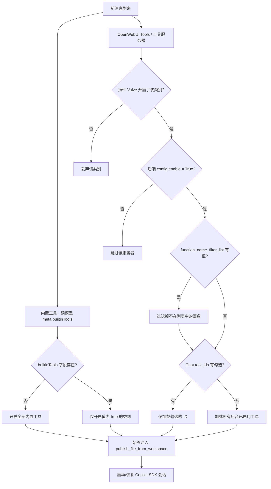

# GitHub Copilot SDK 工具过滤逻辑开发文档

## 核心需求

**管理员在后台修改工具服务的启用状态后，用户发送下一条消息时立即生效，无需重启服务或刷新缓存。**

过滤逻辑同时兼顾两个目标：管理员管控权、用户自主选择权。内置工具则完全独立，仅由模型配置决定。

---

## 工具分类说明

本文档涉及两类完全独立的工具，权限控制机制不同：

| 工具类型 | 说明 | 权限控制来源 |
|---|---|---|
| **内置工具（Builtin Tools）** | OpenWebUI 原生能力：时间、知识库、记忆、联网搜索、图像生成、代码解释器等 | 仅由模型配置 `meta.builtinTools` 决定，**与 Chat 前端选择无关** |
| **OpenWebUI Tools** | 用户安装的 Python 工具插件 | 插件 Valve + Chat 工具选择（tool_ids） |
| **工具服务器（OpenAPI / MCP）** | 外部 OpenAPI Server、MCP Server | 插件 Valve + 管理员 `config.enable` + `function_name_filter_list` + Chat 工具选择（tool_ids） |

---

## 内置工具权限控制（模型配置驱动，与前端无关）

内置工具**完全由模型配置决定**，Chat 界面的工具选择对其没有任何影响。

### 模型 `meta.builtinTools` 字段

在模型（自定义模型或基础模型）的 `meta` 字段中有一个可选的 `builtinTools` 对象：

```json
{
  "meta": {
    "capabilities": { "builtin_tools": true },
    "builtinTools": {
      "time": false,
      "memory": true,
      "chats": true,
      "notes": true,
      "knowledge": true,
      "channels": true,
      "web_search": true,
      "image_generation": true,
      "code_interpreter": true
    }
  }
}
```

**判定规则（源码 `utils/tools.py`）：**

```python
def is_builtin_tool_enabled(category: str) -> bool:
    builtin_tools = model.get("info", {}).get("meta", {}).get("builtinTools", {})
    return builtin_tools.get(category, True)  # 缺省时默认 True
```

- `builtinTools` 字段**不存在** → 所有内置工具类别默认全部开启
- `builtinTools` 字段**存在** → 仅值为 `true` 的类别开启，其余关闭

---

## OpenWebUI Tools 和工具服务器的优先级层级

这两类工具的过滤从上到下依次执行，**受 Chat 前端选择影响**：

| 优先级 | 层级 | 控制范围 |
|---|---|---|
| 1（最高） | **插件 Valve 开关** | `ENABLE_OPENWEBUI_TOOLS` / `ENABLE_MCP_SERVER` / `ENABLE_OPENAPI_SERVER` — 类别总开关 |
| 2 | **管理员后端服务器开关** | OpenWebUI 连接面板中每个服务器的 `config.enable` — 控制具体服务器是否启用 |
| 3 | **管理员函数名过滤列表** | 工具服务器 `config.function_name_filter_list` — 限制该服务器对外暴露的函数列表（逗号分隔） |
| 4（最低） | **用户 Chat 工具选择** | Chat 界面的 `tool_ids` — 在已启用范围内进一步筛选：未选则全选，有选则仅选中的 |

### 管理员函数名过滤列表说明

OpenWebUI 后台的工具服务器连接配置中支持设置 `function_name_filter_list` 字段（逗号分隔的函数名），用于限制该服务器对外暴露的函数。源码逻辑：

```python
# utils/tools.py
function_name_filter_list = tool_server_connection.get("config", {}).get("function_name_filter_list", "")
if isinstance(function_name_filter_list, str):
    function_name_filter_list = function_name_filter_list.split(",")

for spec in specs:
    function_name = spec["name"]
    if function_name_filter_list:
        if not is_string_allowed(function_name, function_name_filter_list):
            continue  # 不在列表中的函数被跳过
```

- 列表**为空** → 该服务器所有函数均可用
- 列表**有值** → 只有名称匹配的函数会被暴露给用户

---

## 核心判定流程



---

## 场景速查表

### 内置工具（与前端选择无关）

| 模型配置 | 结果 |
|---|---|
| `meta.builtinTools` 字段不存在 | 全部内置工具类别开启 |
| `meta.builtinTools` 字段存在 | 仅 `true` 的类别开启 |

### OpenWebUI Tools / 工具服务器（受 Chat 前端选择影响）

| Chat 工具选择情况 | 加载逻辑 |
|---|---|
| 什么都没选 | 加载所有 Valve 开启且后台已启用的工具（Python Tools + OpenAPI + MCP） |
| 选了部分 tool_ids | 仅加载勾选的 ID（必须同时通过 Valve 和 config.enable 校验） |

---

## 代码实现详述

### 1. 管理员后台变更即时同步

OpenWebUI 通过 `PersistentConfig` + Redis 保证多 worker 之间的配置同步，插件直接读取 `request.app.state.config.TOOL_SERVER_CONNECTIONS` 即可获取最新值：

- 后台**启用**一个服务器 → **下一条消息**就出现。
- 后台**禁用**一个服务器 → **下一条消息**就消失。

```python
# 直接读取 OpenWebUI 的配置对象，有 Redis 时每次读取都会同步最新值
connections = request.app.state.config.TOOL_SERVER_CONNECTIONS  # list

for server in connections:
    config = server.get("config", {})
    is_enabled = config.get("enable", False)  # 每条服务器、每次请求都检查
    if not is_enabled:
        continue  # 立即跳过，硬性拦截
```

    if not is_enabled:
        continue  # 立即跳过，硬性拦截

```

### 2. 内置工具直接透传给 OpenWebUI 处理

插件调用 OpenWebUI 的 `get_builtin_tools(request, extra_params, model)` 时，将 `model` 原样传入即可。OpenWebUI 内部会自动读取 `model.info.meta.builtinTools` 来决定哪些内置工具生效：

```python
# OpenWebUI 源码 utils/tools.py 中的判定逻辑（开发参考，非插件代码）
def is_builtin_tool_enabled(category: str) -> bool:
    builtin_tools = model.get("info", {}).get("meta", {}).get("builtinTools", {})
    return builtin_tools.get(category, True)  # 缺省值 True：未配置时全部开启
```

插件无需自行维护内置工具分类映射，也不需要向 `builtinTools` 注入任何值。

### 3. 自定义工具"默认全选"（白名单仅在显式勾选时激活）

白名单**只有在用户明确勾选了 tool_ids 时才启用**。未勾选任何工具时，加载所有后台已启用工具：

```python
# tool_ids 来自 Chat 请求体
if tool_ids:
    # 白名单模式：严格只保留勾选项
    available_ids = [tid for tid in available_ids if tid in tool_ids]
else:
    # 无勾选：加载所有后台已启用工具（免配置可用）
    pass  # available_ids 保持不变
```

MCP 服务器的 `_parse_mcp_servers` 遵循同样规则。

### 4. 后端状态硬校验（OpenAPI 和 MCP 统一处理）

```python
is_enabled = False
config = server.get("config", {}) if isinstance(server, dict) else getattr(server, "config", {})
is_enabled = config.get("enable", False) if isinstance(config, dict) else getattr(config, "enable", False)

if not is_enabled:
    continue  # 硬性跳过，任何用户或 Valve 设置都无法绕过
```

---

## 注意事项

- **SDK 内部工具**：向会话传 `available_tools = None`，保证 `read_file`、`shell` 等 SDK 原生能力不被自定义工具列表意外屏蔽。
- **始终注入的工具**：`publish_file_from_workspace` 在所有过滤完成后硬性追加，是文件交付工作流的必要依赖，不受任何开关影响。
