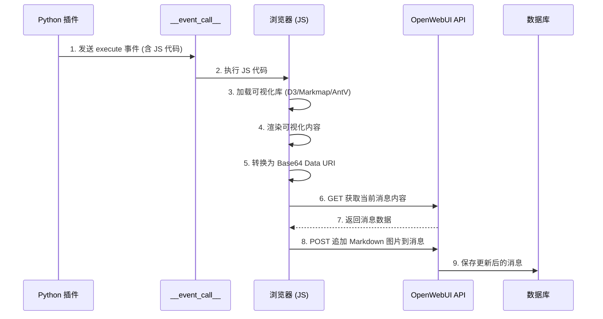

# 使用 JavaScript 生成可视化内容的技术方案

## 概述

本文档描述了在 OpenWebUI Action 插件中使用浏览器端 JavaScript 代码生成可视化内容（如思维导图、信息图等）并将结果保存到消息中的技术方案。

## 核心架构



## 关键步骤

### 1. Python 端通过 `__event_call__` 执行 JS

Python 插件**不直接修改 `body["messages"]`**，而是通过 `__event_call__` 发送 JS 代码让浏览器执行：

```python
async def action(
    self,
    body: dict,
    __user__: dict = None,
    __event_emitter__=None,
    __event_call__: Optional[Callable[[Any], Awaitable[None]]] = None,
    __metadata__: Optional[dict] = None,
    __request__: Request = None,
) -> dict:
    # 从 body 获取 chat_id 和 message_id
    chat_id = body.get("chat_id", "")
    message_id = body.get("id", "")  # 注意：body["id"] 是 message_id
    
    # 通过 __event_call__ 执行 JS 代码
    if __event_call__:
        await __event_call__({
            "type": "execute",
            "data": {
                "code": f"""
(async function() {{
    const chatId = "{chat_id}";
    const messageId = "{message_id}";
    // ... JS 渲染和 API 更新逻辑 ...
}})();
                """
            },
        })
    
    # 不修改 body，直接返回
    return body
```

### 2. JavaScript 加载可视化库

在浏览器端动态加载所需的 JS 库：

```javascript
// 加载 D3.js
if (!window.d3) {
    await new Promise((resolve, reject) => {
        const script = document.createElement('script');
        script.src = 'https://cdn.jsdelivr.net/npm/d3@7';
        script.onload = resolve;
        script.onerror = reject;
        document.head.appendChild(script);
    });
}

// 加载 Markmap (思维导图)
if (!window.markmap) {
    await loadScript('https://cdn.jsdelivr.net/npm/markmap-lib@0.17');
    await loadScript('https://cdn.jsdelivr.net/npm/markmap-view@0.17');
}
```

### 3. 渲染并转换为 Data URI

```javascript
// 创建 SVG 元素
const svg = document.createElementNS('http://www.w3.org/2000/svg', 'svg');
svg.setAttribute('width', '800');
svg.setAttribute('height', '600');
svg.setAttribute('xmlns', 'http://www.w3.org/2000/svg');

// ... 执行渲染逻辑 (添加图形元素) ...

// 转换为 Base64 Data URI
const svgData = new XMLSerializer().serializeToString(svg);
const base64 = btoa(unescape(encodeURIComponent(svgData)));
const dataUri = 'data:image/svg+xml;base64,' + base64;
```

### 4. 获取当前消息内容

由于 Python 端不传递原始内容，JS 需要通过 API 获取：

```javascript
const token = localStorage.getItem('token');

// 获取当前聊天数据
const getResponse = await fetch(`/api/v1/chats/${chatId}`, {
    method: 'GET',
    headers: {
        'Authorization': `Bearer ${token}`
    }
});

const chatData = await getResponse.json();

// 查找目标消息
let originalContent = '';
if (chatData.chat && chatData.chat.messages) {
    const targetMsg = chatData.chat.messages.find(m => m.id === messageId);
    if (targetMsg && targetMsg.content) {
        originalContent = targetMsg.content;
    }
}
```

### 5. 调用 API 更新消息

```javascript
// 构造新内容：原始内容 + Markdown 图片
const markdownImage = ``;
const newContent = originalContent + '\n\n' + markdownImage;

// 调用 API 更新消息
const response = await fetch(`/api/v1/chats/${chatId}/messages/${messageId}/event`, {
    method: 'POST',
    headers: {
        'Content-Type': 'application/json',
        'Authorization': `Bearer ${token}`
    },
    body: JSON.stringify({
        type: 'chat:message',
        data: { content: newContent }
    })
});

if (response.ok) {
    console.log('消息更新成功！');
}
```

## 完整示例

参考 [js_render_poc.py](../plugins/actions/js-render-poc/js_render_poc.py) 获取完整的 PoC 实现。

## 事件类型

| 类型 | 用途 |
|------|------|
| `chat:message:delta` | 增量更新（追加文本） |
| `chat:message` | 完全替换消息内容 |

```javascript
// 增量更新
{ type: "chat:message:delta", data: { content: "追加的内容" } }

// 完全替换
{ type: "chat:message", data: { content: "完整的新内容" } }
```

## 关键数据来源

| 数据 | 来源 | 说明 |
|------|------|------|
| `chat_id` | `body["chat_id"]` | 聊天会话 ID |
| `message_id` | `body["id"]` | ⚠️ 注意：是 `body["id"]`，不是 `body["message_id"]` |
| `token` | `localStorage.getItem('token')` | 用户认证 Token |
| `originalContent` | 通过 API `GET /api/v1/chats/{chatId}` 获取 | 当前消息内容 |

## Python 端 API

| 参数 | 类型 | 说明 |
|------|------|------|
| `__event_emitter__` | Callable | 发送状态/通知事件 |
| `__event_call__` | Callable | 执行 JS 代码（用于可视化渲染） |
| `__metadata__` | dict | 元数据（可能为 None） |
| `body` | dict | 请求体，包含 messages、chat_id、id 等 |

### body 结构示例

```json
{
  "model": "gemini-3-flash-preview",
  "messages": [...],
  "chat_id": "ac2633a3-5731-4944-98e3-bf9b3f0ef0ab",
  "id": "2e0bb7d4-dfc0-43d7-b028-fd9e06c6fdc8",
  "session_id": "bX30sHI8r4_CKxCdAAAL"
}
```

### 常用事件

```python
# 发送状态更新
await __event_emitter__({
    "type": "status",
    "data": {"description": "正在渲染...", "done": False}
})

# 执行 JS 代码
await __event_call__({
    "type": "execute",
    "data": {"code": "console.log('Hello from Python!')"}
})

# 发送通知
await __event_emitter__({
    "type": "notification",
    "data": {"type": "success", "content": "渲染完成！"}
})
```

## 适用场景

- **思维导图** (Markmap)
- **信息图** (AntV Infographic)
- **流程图** (Mermaid)
- **数据图表** (ECharts, Chart.js)
- **任何需要 JS 渲染的可视化内容**

## 注意事项

### 1. 竞态条件问题

⚠️ **多次快速点击会导致内容覆盖问题**

由于 API 调用是异步的，如果用户快速多次触发 Action：
- 第一次点击：获取原始内容 A → 渲染 → 更新为 A+图片1
- 第二次点击：可能获取到旧内容 A（第一次还没保存完）→ 更新为 A+图片2

结果：图片1 被覆盖丢失！

**解决方案**：
- 添加防抖（debounce）机制
- 使用锁/标志位防止重复执行
- 或使用 `chat:message:delta` 增量更新

### 2. 不要直接修改 `body["messages"]`

消息更新应由 JS 通过 API 完成，确保获取最新内容。

### 3. f-string 限制

Python f-string 内不能直接使用反斜杠，需要将转义字符串预先处理：

```python
# 转义 JSON 中的特殊字符
body_json = json.dumps(data, ensure_ascii=False)
escaped = body_json.replace("\\", "\\\\").replace("`", "\\`").replace("${", "\\${")
```

### 4. Data URI 大小限制

Base64 编码会增加约 33% 的体积，复杂图片可能导致消息过大。

### 5. 跨域问题

确保 CDN 资源支持 CORS。

### 6. API 权限

确保用户 token 有权限访问和更新目标消息。

## 与传统方式对比

| 特性 | 传统方式 (修改 body) | 新方式 (__event_call__) |
|------|---------------------|------------------------|
| 消息更新 | Python 直接修改 | JS 通过 API 更新 |
| 原始内容 | Python 传递给 JS | JS 通过 API 获取 |
| 灵活性 | 低 | 高 |
| 实时性 | 一次性 | 可多次更新 |
| 复杂度 | 简单 | 中等 |
| 竞态风险 | 低 | ⚠️ 需要处理 |
