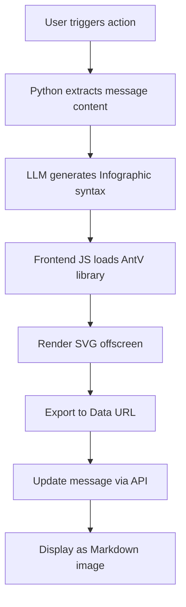

# Infographic to Markdown

> **Version:** 1.0.0 | **Author:** Fu-Jie

AI-powered infographic generator that renders SVG on the frontend and embeds it directly into Markdown as a Data URL image.

## Overview

This plugin combines the power of AI text analysis with AntV Infographic visualization to create beautiful infographics that are embedded directly into chat messages as Markdown images.

### Key Features

- :robot: **AI-Powered**: Automatically analyzes text and selects the best infographic template
- :bar_chart: **Multiple Templates**: Supports 18+ infographic templates (lists, charts, comparisons, etc.)
- :framed_picture: **Self-Contained**: SVG/PNG embedded as Data URL, no external dependencies
- :memo: **Markdown Native**: Results are pure Markdown images, compatible everywhere
- :arrows_counterclockwise: **API Writeback**: Updates message content via REST API for persistence

### How It Works



## Installation

1. Download `infographic_markdown.py` (English) or `infographic_markdown_cn.py` (Chinese)
2. Navigate to **Admin Panel** → **Settings** → **Functions**
3. Upload the file and configure settings
4. Use the action button in chat messages

## Configuration

| Parameter | Type | Default | Description |
|-----------|------|---------|-------------|
| `SHOW_STATUS` | bool | `true` | Show operation status updates |
| `MODEL_ID` | string | `""` | LLM model ID (empty = use current model) |
| `MIN_TEXT_LENGTH` | int | `50` | Minimum text length required |
| `MESSAGE_COUNT` | int | `1` | Number of recent messages to use |
| `SVG_WIDTH` | int | `800` | Width of generated SVG (pixels) |
| `EXPORT_FORMAT` | string | `"svg"` | Export format: `svg` or `png` |

## Supported Templates

| Category | Template | Description |
|----------|----------|-------------|
| List | `list-grid` | Grid cards |
| List | `list-vertical` | Vertical list |
| Tree | `tree-vertical` | Vertical tree |
| Tree | `tree-horizontal` | Horizontal tree |
| Mind Map | `mindmap` | Mind map |
| Process | `sequence-roadmap` | Roadmap |
| Process | `sequence-zigzag` | Zigzag process |
| Relation | `relation-sankey` | Sankey diagram |
| Relation | `relation-circle` | Circular relation |
| Compare | `compare-binary` | Binary comparison |
| Analysis | `compare-swot` | SWOT analysis |
| Quadrant | `quadrant-quarter` | Quadrant chart |
| Chart | `chart-bar` | Bar chart |
| Chart | `chart-column` | Column chart |
| Chart | `chart-line` | Line chart |
| Chart | `chart-pie` | Pie chart |
| Chart | `chart-doughnut` | Doughnut chart |
| Chart | `chart-area` | Area chart |

## Usage Example

1. Generate some text content in the chat (or have the AI generate it)
2. Click the **📊 Infographic to Markdown** action button
3. Wait for AI analysis and SVG rendering
4. The infographic will be embedded as a Markdown image

## Technical Details

### Data URL Embedding

The plugin converts SVG graphics to Base64-encoded Data URLs:

```javascript
const svgData = new XMLSerializer().serializeToString(svg);
const base64 = btoa(unescape(encodeURIComponent(svgData)));
const dataUri = "data:image/svg+xml;base64," + base64;
const markdownImage = ``;
```

### AntV toDataURL API

```javascript
// Export as SVG (recommended)
const svgUrl = await instance.toDataURL({
    type: 'svg',
    embedResources: true
});

// Export as PNG
const pngUrl = await instance.toDataURL({
    type: 'png',
    dpr: 2
});
```

## Notes

1. **Browser Compatibility**: Requires modern browsers with ES6+ and Fetch API support
2. **Network Dependency**: First use requires loading AntV library from CDN
3. **Data URL Size**: Base64 encoding increases size by ~33%
4. **Chinese Fonts**: SVG export embeds fonts for correct display

## Related Resources

- [AntV Infographic Documentation](https://infographic.antv.vision/)
- [Infographic API Reference](https://infographic.antv.vision/reference/infographic-api)
- [Infographic Syntax Guide](https://infographic.antv.vision/learn/infographic-syntax)
