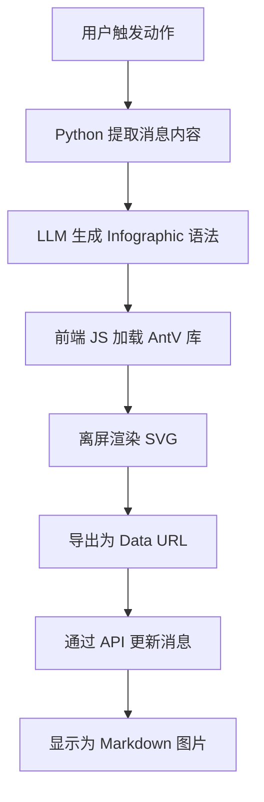

# 信息图转 Markdown

> **版本:** 1.0.0 | **作者:** Fu-Jie

AI 驱动的信息图生成器，在前端渲染 SVG 并以 Data URL 图片格式直接嵌入到 Markdown 中。

## 概述

这个插件结合了 AI 文本分析能力和 AntV Infographic 可视化引擎，生成精美的信息图并以 Markdown 图片格式直接嵌入到聊天消息中。

### 主要特性

- :robot: **AI 驱动**: 自动分析文本并选择最佳的信息图模板
- :bar_chart: **多种模板**: 支持 18+ 种信息图模板（列表、图表、对比等）
- :framed_picture: **自包含**: SVG/PNG 以 Data URL 嵌入，无外部依赖
- :memo: **Markdown 原生**: 结果是纯 Markdown 图片，兼容任何平台
- :arrows_counterclockwise: **API 回写**: 通过 REST API 更新消息内容实现持久化

### 工作原理



## 安装

1. 下载 `infographic_markdown.py`（英文版）或 `infographic_markdown_cn.py`（中文版）
2. 进入 **管理面板** → **设置** → **功能**
3. 上传文件并配置设置
4. 在聊天消息中使用动作按钮

## 配置选项

| 参数 | 类型 | 默认值 | 描述 |
|------|------|--------|------|
| `SHOW_STATUS` | bool | `true` | 是否显示操作状态 |
| `MODEL_ID` | string | `""` | LLM 模型 ID（空则使用当前模型） |
| `MIN_TEXT_LENGTH` | int | `50` | 最小文本长度要求 |
| `MESSAGE_COUNT` | int | `1` | 用于生成的最近消息数量 |
| `SVG_WIDTH` | int | `800` | 生成的 SVG 宽度（像素） |
| `EXPORT_FORMAT` | string | `"svg"` | 导出格式：`svg` 或 `png` |

## 支持的模板

| 类别 | 模板名称 | 描述 |
|------|----------|------|
| 列表 | `list-grid` | 网格卡片 |
| 列表 | `list-vertical` | 垂直列表 |
| 树形 | `tree-vertical` | 垂直树 |
| 树形 | `tree-horizontal` | 水平树 |
| 思维导图 | `mindmap` | 思维导图 |
| 流程 | `sequence-roadmap` | 路线图 |
| 流程 | `sequence-zigzag` | 折线流程 |
| 关系 | `relation-sankey` | 桑基图 |
| 关系 | `relation-circle` | 圆形关系 |
| 对比 | `compare-binary` | 二元对比 |
| 分析 | `compare-swot` | SWOT 分析 |
| 象限 | `quadrant-quarter` | 四象限图 |
| 图表 | `chart-bar` | 条形图 |
| 图表 | `chart-column` | 柱状图 |
| 图表 | `chart-line` | 折线图 |
| 图表 | `chart-pie` | 饼图 |
| 图表 | `chart-doughnut` | 环形图 |
| 图表 | `chart-area` | 面积图 |

## 使用示例

1. 在聊天中生成一些文本内容（或让 AI 生成）
2. 点击 **📊 信息图转 Markdown** 动作按钮
3. 等待 AI 分析和 SVG 渲染
4. 信息图将以 Markdown 图片形式嵌入

## 技术细节

### Data URL 嵌入

插件将 SVG 图形转换为 Base64 编码的 Data URL：

```javascript
const svgData = new XMLSerializer().serializeToString(svg);
const base64 = btoa(unescape(encodeURIComponent(svgData)));
const dataUri = "data:image/svg+xml;base64," + base64;
const markdownImage = ``;
```

### AntV toDataURL API

```javascript
// 导出 SVG（推荐）
const svgUrl = await instance.toDataURL({
    type: 'svg',
    embedResources: true
});

// 导出 PNG
const pngUrl = await instance.toDataURL({
    type: 'png',
    dpr: 2
});
```

## 注意事项

1. **浏览器兼容性**: 需要现代浏览器支持 ES6+ 和 Fetch API
2. **网络依赖**: 首次使用需要从 CDN 加载 AntV Infographic 库
3. **Data URL 大小**: Base64 编码会增加约 33% 的体积
4. **中文字体**: SVG 导出时会嵌入字体以确保正确显示

## 相关资源

- [AntV Infographic 官方文档](https://infographic.antv.vision/)
- [Infographic API 参考](https://infographic.antv.vision/reference/infographic-api)
- [Infographic 语法规范](https://infographic.antv.vision/learn/infographic-syntax)
