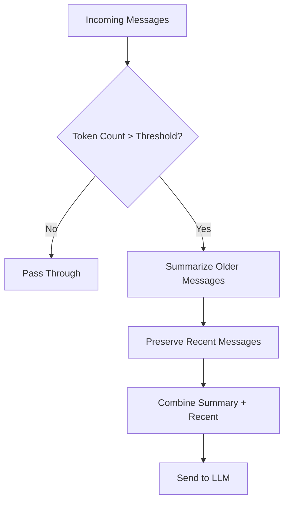

# Async Context Compression

<span class="category-badge filter">Filter</span>
<span class="version-badge">v1.2.0</span>

Reduces token consumption in long conversations through intelligent summarization while maintaining conversational coherence.

---

## Overview

The Async Context Compression filter helps manage token usage in long conversations by:

- Intelligently summarizing older messages
- Preserving important context
- Reducing API costs
- Maintaining conversation coherence

This is especially useful for:

- Long-running conversations
- Complex multi-turn discussions
- Cost optimization
- Token limit management

## Features

- :material-arrow-collapse-vertical: **Smart Compression**: AI-powered context summarization
- :material-clock-fast: **Async Processing**: Non-blocking background compression
- :material-memory: **Context Preservation**: Keeps important information
- :material-currency-usd-off: **Cost Reduction**: Minimize token usage
- :material-console: **Frontend Debugging**: Debug logs in browser console
- :material-alert-circle-check: **Enhanced Error Reporting**: Clear error status notifications
- :material-check-all: **Open WebUI v0.7.x Compatibility**: Dynamic DB session handling
- :material-account-convert: **Improved Compatibility**: Summary role changed to `assistant`
- :material-shield-check: **Enhanced Stability**: Resolved race conditions in state management
- :material-ruler: **Preflight Context Check**: Validates context fit before sending
- :material-format-align-justify: **Structure-Aware Trimming**: Preserves document structure
- :material-content-cut: **Native Tool Output Trimming**: Trims verbose tool outputs (Note: Non-native tool outputs are not fully injected into context)
- :material-chart-bar: **Detailed Token Logging**: Granular token breakdown

---

## Installation

1. Download the plugin file: [`async_context_compression.py`](https://github.com/Fu-Jie/awesome-openwebui/tree/main/plugins/filters/async-context-compression)
2. Upload to OpenWebUI: **Admin Panel** → **Settings** → **Functions**
3. Configure compression settings
4. Enable the filter

---

## How It Works



---

## Configuration

| Option | Type | Default | Description |
|--------|------|---------|-------------|
| `compression_threshold_tokens` | integer | `64000` | Trigger compression above this token count |
| `max_context_tokens` | integer | `128000` | Hard limit for context |
| `keep_first` | integer | `1` | Always keep the first N messages |
| `keep_last` | integer | `6` | Always keep the last N messages |
| `summary_model` | string | `None` | Model to use for summarization |
| `max_summary_tokens` | integer | `16384` | Maximum tokens for the summary |
| `enable_tool_output_trimming` | boolean | `false` | Enable trimming of large tool outputs |

---

## Example

### Before Compression

```
[Message 1] User: Tell me about Python...
[Message 2] AI: Python is a programming language...
[Message 3] User: What about its history?
[Message 4] AI: Python was created by Guido...
[Message 5] User: And its features?
[Message 6] AI: Python has many features...
... (many more messages)
[Message 20] User: Current question
```

### After Compression

```
[Summary] Previous conversation covered Python basics,
history, features, and common use cases...

[Message 18] User: Recent question about decorators
[Message 19] AI: Decorators in Python are...
[Message 20] User: Current question
```

---

## Requirements

!!! note "Prerequisites"
    - OpenWebUI v0.3.0 or later
    - Access to an LLM for summarization

!!! tip "Best Practices"
    - Set appropriate token thresholds based on your model's context window
    - Preserve more recent messages for technical discussions
    - Test compression settings in non-critical conversations first

---

## Troubleshooting

??? question "Compression not triggering?"
    Check if the token count exceeds your configured threshold. Enable debug logging for more details.

??? question "Important context being lost?"
    Increase the `preserve_recent` setting or lower the compression ratio.

---

## Source Code

[:fontawesome-brands-github: View on GitHub](https://github.com/Fu-Jie/awesome-openwebui/tree/main/plugins/filters/async-context-compression){ .md-button }
