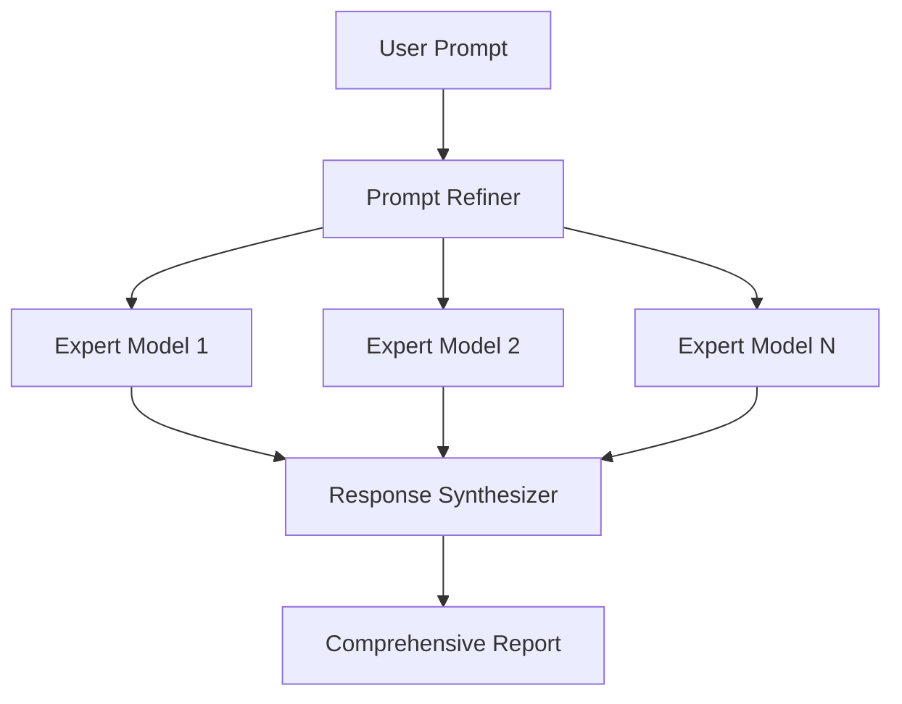

# MoE Prompt Refiner

<span class="category-badge pipeline">Pipeline</span>
<span class="version-badge">v1.0.0</span>

Refines prompts for Mixture of Experts (MoE) summary requests to generate high-quality comprehensive reports.

---

## Overview

The MoE Prompt Refiner is an advanced pipeline that optimizes prompts before sending them to multiple expert models, then synthesizes the responses into comprehensive, high-quality reports.

## Features

- :material-view-module: **Multi-Model**: Leverages multiple AI models
- :material-text-search: **Prompt Optimization**: Refines prompts for best results
- :material-merge: **Response Synthesis**: Combines expert responses
- :material-file-document: **Report Generation**: Creates structured reports

---

## Installation

1. Download the pipeline file: [`moe_prompt_refiner.py`](https://github.com/Fu-Jie/awesome-openwebui/tree/main/plugins/pipelines)
2. Upload to OpenWebUI: **Admin Panel** → **Settings** → **Functions**
3. Configure expert models and settings
4. Enable the pipeline

---

## How It Works



---

## Configuration

| Option | Type | Default | Description |
|--------|------|---------|-------------|
| `expert_models` | list | `[]` | List of models to consult |
| `synthesis_model` | string | `"auto"` | Model for synthesizing responses |
| `report_format` | string | `"markdown"` | Output format |

---

## Use Cases

- **Research Reports**: Gather insights from multiple AI perspectives
- **Comprehensive Analysis**: Multi-faceted problem analysis
- **Decision Support**: Balanced recommendations from diverse models
- **Content Creation**: Rich, multi-perspective content

---

## Example

**Input Prompt:**
```
Analyze the pros and cons of microservices architecture
```

**Output Report:**
```markdown
# Microservices Architecture Analysis

## Executive Summary
Based on analysis from multiple expert perspectives...

## Advantages
1. **Scalability** (Expert A)...
2. **Technology Flexibility** (Expert B)...

## Disadvantages
1. **Complexity** (Expert A)...
2. **Distributed System Challenges** (Expert C)...

## Recommendations
Synthesized recommendations based on expert consensus...
```

---

## Requirements

!!! note "Prerequisites"
    - OpenWebUI v0.3.0 or later
    - Access to multiple LLM models
    - Sufficient API quotas for multi-model queries

!!! warning "Resource Usage"
    This pipeline makes multiple API calls per request. Monitor your usage and costs.

---

## Source Code

[:fontawesome-brands-github: View on GitHub](https://github.com/Fu-Jie/awesome-openwebui/tree/main/plugins/pipelines){ .md-button }
