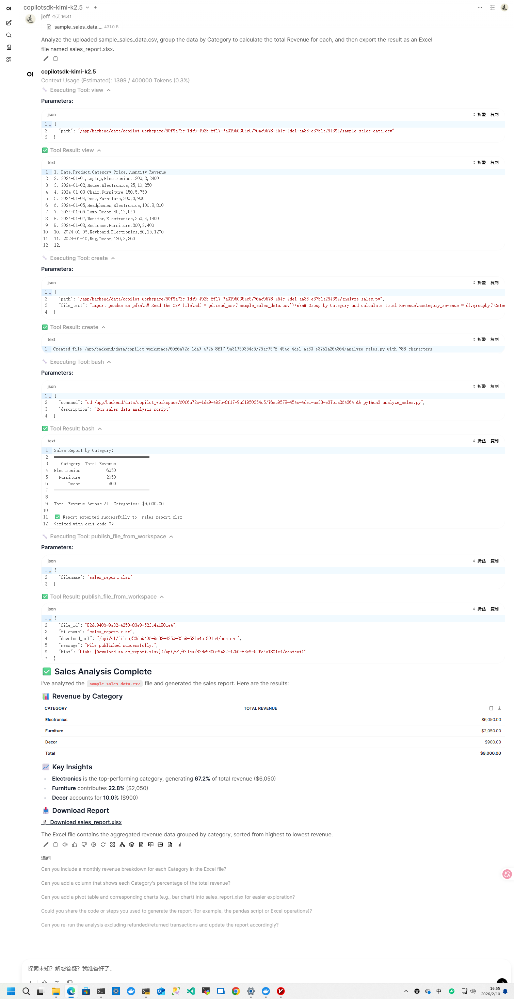

# GitHub Copilot SDK Advanced Tutorial

**Author:** [Fu-Jie](https://github.com/Fu-Jie) | **Version:** 1.0.0 | **Project:** [Awesome OpenWebUI](https://github.com/Fu-Jie/awesome-openwebui)

This tutorial guides you through unleashing the full potential of the GitHub Copilot SDK plugin, specifically focusing on advanced file generation, BYOK customization, and complex task orchestration.

---

## 1. The 3-Step File Delivery Protocol

This is one of the most powerful features of this plugin. Agents can generate real physical files (e.g., `.xlsx`, `.pdf`, `.csv`) in their isolated workspace and publish them for you to download.

### Automated Execution Logic:
1.  **Write (Local)**: The Agent creates a file using code within its isolated directory (the current directory `.` during Python execution).
2.  **Publish**: The Agent automatically calls `publish_file_from_workspace(filename='report.xlsx')`.
3.  **Link**: The plugin handles S3 or local storage mapping, bypasses RAG interference, and returns a secure link like `/api/v1/files/.../content`.

> [!TIP]
> **User Command Tip**: You can simply tell the Agent: "Analyze the previous data and export an Excel sheet for me." It will automatically trigger this entire sequence.

---

## 2. Advanced BYOK (Bring Your Own Key) Mode

If you don't have a GitHub Copilot subscription or want to use high-end models from OpenAI/Anthropic directly, you can use the BYOK mode.

### How to Configure:
1.  **Set Base URL**: e.g., `https://api.openai.com/v1`.
2.  **Set API Key**: Enter your key in your personal settings (Valves).
3.  **Real-time Model Refresh**: The plugin features a **Config-Aware Refresh** mechanism. When you modify the API Key or Base URL, simply refresh the model selector in the UI—the plugin will automatically fetch the latest available models from the backend.

---

## 3. Workspace Isolation & Debugging

Every chat session has a physically isolated folder, ensuring that files from different tasks do not interfere with each other.

### Physical Path Rules:
- **In-Container Path**: `/app/backend/data/copilot_workspace/{user_id}/{chat_id}/`
- **Agent's Perspective**: It sees the `.` directory as the path mentioned above.

### Debugging Pro Tips:
1.  **Enable DEBUG Valve**: Set `DEBUG` to `True` in the configuration.
2.  **Check the Console**: Open browser developer tools (F12) -> Console.
3.  **Capture Paths**: You will see logs like `📂 Workspace Resolved: /.../`, which helps you confirm exactly where the Agent is writing its files.

---

## 4. Deep Analysis Bypassing RAG

Traditional file uploads in OpenWebUI trigger vectorization (RAG), which might not be precise enough for large-scale data analysis.

**Advantages of this Plugin**:
- When used with the [Files Filter](https://openwebui.com/posts/403a62ee-a596-45e7-be65-fab9cc249dd6) plugin, the Agent can **directly read every byte** of the raw file.
- It can analyze every row of a CSV as if it were running a script locally, preventing information loss caused by retrieval-based slicing.

---

## 5. Common Interaction Examples

- **Data Conversion**: "Convert this JSON content into a beautifully formatted Word document and provide a download link."
- **Code Review**: "Read all `.py` files in the workspace, find potential bugs, and publish the suggestions as a Markdown report."
- **Chart Generation**: "Generate an Excel report based on the financial data and use Python to draw a trend chart for me."

---

## 🚀 Real-world Example: Automated Financial Analysis

### Scenario
A user uploads a raw sales log named `sales_data.csv` and asks the AI to generate a summarized Excel report.

### 1. User Command
> "Analyze `sales_data.csv` in the current directory, calculate total revenue per product category, and export an Excel file named `category_summary.xlsx` for me."

### 2. Agent Execution Flow
The Agent performs the following steps autonomously:

*   **Step 1: Write and Run Python Code**
    ```python
    import pandas as pd
    # Direct file access in the isolated workspace (Bypassing RAG for 100% accuracy)
    df = pd.read_csv('sales_data.csv')
    summary = df.groupby('Category')['Revenue'].sum().reset_index()
    # Save the result locally
    summary.to_excel('category_summary.xlsx', index=False)
    ```
*   **Step 2: Call the Publishing Tool**
    The Agent calls: `publish_file_from_workspace(filename="category_summary.xlsx")`
*   **Step 3: Deliver the Link**
    The tool returns a `download_url`, which the Agent presents to the user.

### 3. Final Result
The Agent responds:
> "Analysis complete! I have summarized the revenue by category. You can download your report here:
> 
> [📊 Download: Category_Summary.xlsx](/api/v1/files/uuid-hash/content)"

#### Execution Screenshot


---

## ⭐ Continuous Improvement

If you encounter any issues or have suggestions for new features, feel free to submit an Issue or participate in discussions on [Awesome OpenWebUI](https://github.com/Fu-Jie/awesome-openwebui).
