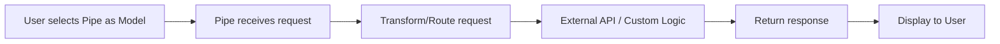

# Pipe Plugins

Pipe plugins create custom model integrations or transform LLM responses. They appear as selectable models in the OpenWebUI interface.

## What are Pipes?

Pipes allow you to:

- :material-api: Connect to external AI APIs (Gemini, Claude, etc.)
- :material-robot: Create custom model wrappers
- :material-cog-transfer: Transform requests and responses
- :material-middleware: Implement middleware logic

---

## Available Pipe Plugins

- [GitHub Copilot SDK](github-copilot-sdk.md) (v0.5.1) - Official GitHub Copilot SDK integration. Features **zero-config OpenWebUI Tool Bridge**, **BYOK** support, and **dynamic MCP discovery**. Supports streaming, multimodal, and infinite sessions.

---

## How Pipes Work



### The `pipes` Method

Defines what models this pipe provides:

```python
def pipes(self):
    return [
        {"id": "my-model", "name": "My Custom Model"},
        {"id": "my-model-fast", "name": "My Custom Model (Fast)"}
    ]
```

### The `pipe` Method

Handles the actual request processing:

```python
def pipe(self, body: dict) -> Generator:
    # Process the request
    messages = body.get("messages", [])
    
    # Call external API or custom logic
    response = call_external_api(messages)
    
    # Return response (can be streaming)
    return response
```

---

## Quick Installation

1. Download the desired pipe `.py` file
2. Navigate to **Admin Panel** → **Settings** → **Functions**
3. Upload the file and configure API keys
4. The pipe will appear as a selectable model

---

## Development Template

```python
"""
title: My Custom Pipe
author: Your Name
version: 1.0.0
description: Description of your pipe plugin
"""

from pydantic import BaseModel, Field
from typing import Generator, Iterator, Union

class Pipe:
    class Valves(BaseModel):
        API_KEY: str = Field(
            default="",
            description="API key for the external service"
        )
        API_URL: str = Field(
            default="https://api.example.com",
            description="API endpoint URL"
        )
    
    def __init__(self):
        self.valves = self.Valves()
    
    def pipes(self) -> list[dict]:
        """Define available models."""
        return [
            {"id": "my-model", "name": "My Custom Model"},
        ]
    
    def pipe(
        self,
        body: dict
    ) -> Union[str, Generator, Iterator]:
        """Process the request and return response."""
        messages = body.get("messages", [])
        model = body.get("model", "")
        
        # Your logic here
        # Can return:
        # - str: Single response
        # - Generator/Iterator: Streaming response
        
        return "Response from custom pipe"
```

For more details, check our [Plugin Development Guide](../../development/plugin-guide.md).
