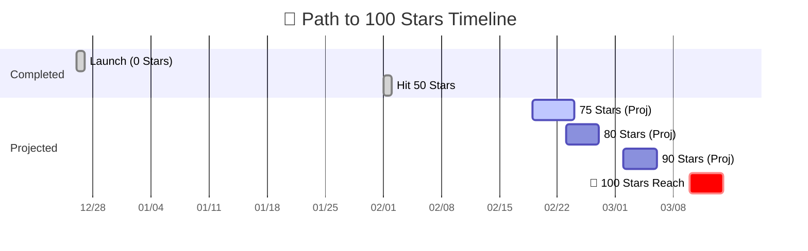

# Case Study: GitHub 100 Star Growth Analysis

This case study demonstrates how to use the **GitHub Copilot SDK Pipe** with the **Minimax 2.1** model to perform a deep analysis of project growth data and predict the milestone of reaching 100 stars.

---

## 🎥 Recording

> **Scenario**: The user uploaded project traffic CSVs and star history data for the last 14 days. The model automatically wrote a Python script for regression analysis, generated an interactive visualization, and provided a detailed growth projection report.

---

## 🛠️ Implementation

- **Plugin Type**: Pipe (GitHub Copilot SDK)
- **Base Model**: Minimax 2.1 (via Pipe integration)
- **Key Capabilities**:
  - **File Processing**: Automatically reads and parses multiple CSV data files.
  - **Code Generation & Execution**: On-the-fly Python scripting to calculate growth rates, conversion rates, and median trends.
  - **Multimodal Output**: Generates Markdown reports, interactive HTML dashboards, and Mermaid timeline charts.

---

## 💬 Conversation Highlights

### 📥 Import Conversation

You can download the raw chat data and import it into your Open WebUI to see the full tool calls and analysis logic:
[:material-download: Download Chat JSON](./star-prediction-chat.json)

> **How to Import?**
> In Open WebUI, click your **User Avatar** (bottom of left sidebar) -> **Settings** -> **Data** -> **Import Chats**, then select the downloaded file.

### 1. Data Submission

The **User** provided traffic source distribution and uploaded:

- `Unique visitors in last 14 days.csv`
- `Total views in last 14 days.csv`
- `star-history.csv`

### 2. Analysis Execution

**Minimax 2.1** received the data and immediately formulated an analysis plan:

1. Calculate star growth trajectory and rates.
2. Analyze visitor-to-star conversion rates.
3. Build linear and median projection models.
4. Generate a milestone timeline.

### 3. Report Generation

The model produced a comprehensive report. Here are the core projections:

#### 🎯 Key Projections

| Metric | Value | Insight |
| :--- | :--- | :--- |
| **Current Stars** | 62 | 62% of the goal reached |
| **Projected Goal Date** | **March 10, 2026** | ~28 days remaining |
| **Avg Growth Rate** | 1.35 stars/day | Highly stable and predictable |
| **Recent Acceleration** | 1.92 stars/day | Growth accelerated by 42% in last 14 days |
| **Conversion Rate** | 4.19% | Significantly higher than the OS average of 1-2% |

---

## 📈 Growth Milestone Timeline

---

## 💡 Strategic Recommendations

1. **Strengthen OpenWebUI Partnership**: 41% of traffic comes from `openwebui.com`. Maintain high visibility on this channel.
2. **SEO Optimization**: Organic search accounts for only 6%. There is massive potential for keyword optimization in the README.
3. **Milestone Momentum**: Plan a social media push around Feb 23 (at the 80-star mark) to leverage the 42% acceleration trend.

---

> [View GitHub Copilot SDK Pipe Documentation](./github-copilot-sdk.md)
