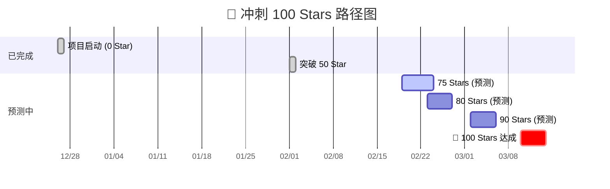

# 案例展示：GitHub 100 Star 增长预测分析

本案例展示了如何使用 **GitHub Copilot SDK Pipe** 配合 **Minimax 2.1** 模型，对项目的增长数据进行深度分析并预测达到 100 Star 的里程碑时间。

---

## 🎥 效果录屏

> **场景描述**：用户上传了过去 14 天的项目访问流量 CSV 和 Star 历史数据。模型自动编写 Python 脚本进行回归分析，生成了可视化看板和详细的增长预测报告。

---

## 🛠️ 技术实现

- **插件类型**: Pipe (GitHub Copilot SDK)
- **底层模型**: Minimax 2.1 (通过 Pipe 接入)
- **核心能力**: 
    - **文件处理**: 自动读取并解析多份 CSV 数据文件。
    - **代码生成与执行**: 现场编写 Python 分析代码并执行，计算增长率、转化率及中位趋势。
    - **多模态输出**: 生成 Markdown 报告、HTML 交互看板以及 Mermaid 时间轴图表。

---

## 💬 对话实录

### 📥 导入对话记录
你可以下载原始对话数据并导入到你的 Open WebUI 中，查看完整的工具调用和分析逻辑：
[:material-download: 下载原始对话 JSON](./star-prediction-chat.json)

> **如何导入？**
> 在 Open WebUI 首页点击 **左侧侧边栏底部个人头像** -> **设置** -> **数据** -> **导入记录**，选择下载的文件即可。

### 1. 提交原始数据
**用户**提供了项目的流量来源分布表，并上传了：
- `Unique visitors in last 14 days.csv`
- `Total views in last 14 days.csv`
- `star-history.csv`

### 2. 模型执行分析
**Minimax 2.1** 接收到数据后，立即制定了分析计划：
1. 计算 Star 增长轨迹和增长率。
2. 分析访问者到 Star 的转化率。
3. 构建线性与中位增长模型进行预测。
4. 生成里程碑时间轴。

### 3. 生成分析报告
模型输出了一份详尽的报告，以下是其核心预测：

#### 🎯 关键预测结果
| 指标 | 数值 | 洞察 |
| :--- | :--- | :--- |
| **当前 Star 数** | 62 | 已完成目标的 62% |
| **预测达成日期** | **2026年3月10日** | 预计还有 28 天 |
| **平均增长率** | 1.35 stars/day | 极其稳定且可预测 |
| **近期加速** | 1.92 stars/day | 过去 14 天增长加速了 42% |
| **Star 转化率** | 4.19% | 远高于开源项目 1-2% 的平均水平 |

---

## 📈 增长里程碑预演

---

## 💡 模型给出的建议

1. **强化 OpenWebUI 社区合作**：41% 的流量来自 `openwebui.com`，应持续在该渠道保持活跃。
2. **SEO 优化**：目前搜索流入仅占 6%，Readme 的关键词优化空间巨大。
3. **关键节点冲刺**：建议在 2 月 23 日（80 Star 节点）发起社交媒体宣传，利用近期 42% 的加速趋势冲刺百星。

---

> [查看 GitHub Copilot SDK Pipe 源码](../../../plugins/pipes/github-copilot-sdk/README.md)
