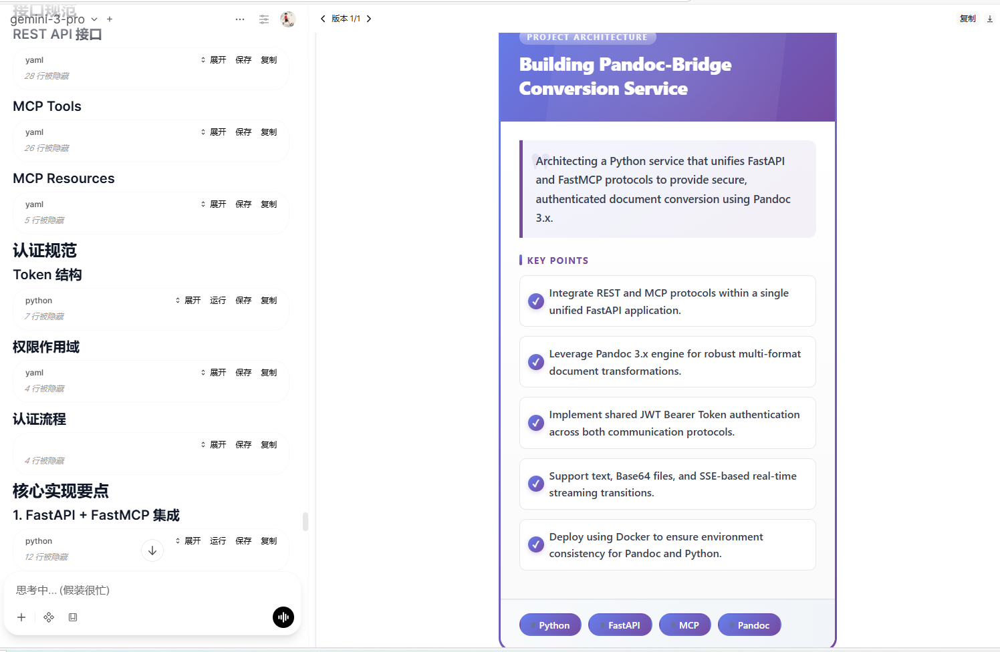

# Flash Card

Generate polished learning flashcards from any text—title, summary, key points, tags, and category—ready for review and sharing.

**Author:** [Fu-Jie](https://github.com/Fu-Jie/awesome-openwebui) | **Version:** 0.2.4 | **Project:** [Awesome OpenWebUI](https://github.com/Fu-Jie/awesome-openwebui) | **License:** MIT

## Preview 📸

## What's New

### v0.2.4
- **Clean Output**: Removed debug messages from output.

## Key Features 🔑

- **One-click generation**: Drop in text, get a structured card.
- **Concise extraction**: 3–5 key points and 2–4 tags automatically surfaced.
- **Multi-language**: Choose target language (default English).
- **Progressive merge**: Multiple runs append cards into the same HTML container; enable clearing to reset.
- **Status updates**: Live notifications for generating/done/error.

## How to Use 🛠️

1. **Install**: Add the plugin to your OpenWebUI instance.
2. **Configure**: Adjust settings in the Valves menu (optional).
3. **Trigger**: Send text to the chat.
4. **Result**: Watch status updates; the card HTML is embedded into the latest message.

## Configuration (Valves) ⚙️

| Param               | Description                                                  | Default |
| ------------------- | ------------------------------------------------------------ | ------- |
| MODEL_ID            | Model to use; empty falls back to current session model      | empty   |
| MIN_TEXT_LENGTH     | Minimum text length; below this prompts for more text        | 50      |
| LANGUAGE            | Output language (e.g., en, zh)                               | en      |
| SHOW_STATUS         | Whether to show status updates                               | true    |
| CLEAR_PREVIOUS_HTML | Whether to clear previous card HTML (otherwise append/merge) | false   |
| MESSAGE_COUNT       | Use the latest N messages to build the card                  | 1       |

## Troubleshooting ❓

- **Plugin not working?**: Check if the filter/action is enabled in the model settings.
- **Debug Logs**: Enable `SHOW_STATUS` in Valves to see progress updates.
- **Error Messages**: If you see an error, please copy the full error message and report it.
- **Submit an Issue**: If you encounter any problems, please submit an issue on GitHub: [Awesome OpenWebUI Issues](https://github.com/Fu-Jie/awesome-openwebui/issues)
