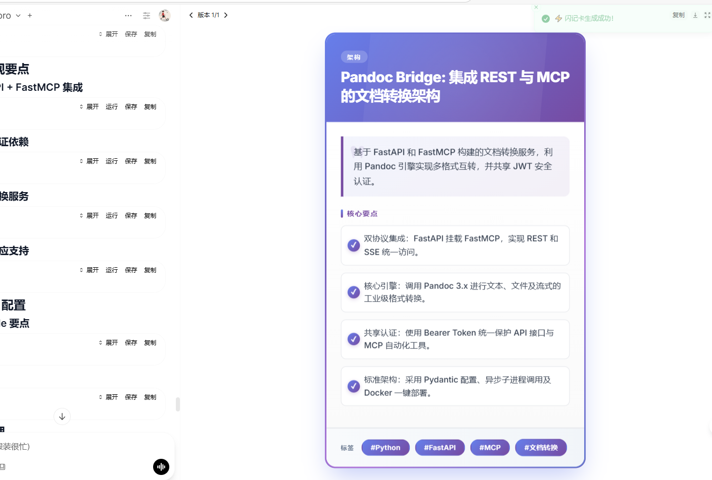

# 闪记卡 (Flash Card)

快速将文本提炼为精美的学习记忆卡片，自动抽取标题、摘要、关键要点、标签和分类，适合复习与分享。

**作者:** [Fu-Jie](https://github.com/Fu-Jie/awesome-openwebui) | **版本:** 0.2.4 | **项目:** [Awesome OpenWebUI](https://github.com/Fu-Jie/awesome-openwebui) | **许可证:** MIT

## 预览 📸

## 更新日志

### v0.2.4
- **输出优化**: 移除输出中的调试信息。

## 核心特性 🔑

- **一键生成**：输入任意文本，直接产出结构化卡片。
- **要点聚合**：自动提取 3-5 个记忆要点与 2-4 个标签。
- **多语言支持**：可设定目标语言（默认中文）。
- **渐进合并**：多次调用会将新卡片合并到同一 HTML 容器中；如需重置可启用清空选项。
- **状态提示**：实时推送“生成中/完成/错误”等状态与通知。

## 使用方法 🛠️

1. **安装**: 在插件市场安装并启用“闪记卡”。
2. **配置**: 根据需要调整 Valves 设置（可选）。
3. **触发**: 将待整理的文本发送到聊天框。
4. **结果**: 等待状态提示，卡片将以 HTML 形式嵌入到最新消息中。

## 配置参数 (Valves) ⚙️

| 参数                | 说明                                  | 默认值 |
| ------------------- | ------------------------------------- | ------ |
| MODEL_ID            | 指定推理模型；为空则使用当前会话模型  | 空     |
| MIN_TEXT_LENGTH     | 最小文本长度，不足时提示补充          | 50     |
| LANGUAGE            | 输出语言（如 zh、en）                 | zh     |
| SHOW_STATUS         | 是否显示状态更新                      | true   |
| CLEAR_PREVIOUS_HTML | 是否清空旧的卡片 HTML（否则合并追加） | false  |
| MESSAGE_COUNT       | 取最近 N 条消息生成卡片               | 1      |

## 故障排除 (Troubleshooting) ❓

- **插件不工作？**: 请检查是否在模型设置中启用了该过滤器/动作。
- **调试日志**: 在 Valves 中启用 `SHOW_STATUS` 以查看进度更新。
- **错误信息**: 如果看到错误，请复制完整的错误信息并报告。
- **提交 Issue**: 如果遇到任何问题，请在 GitHub 上提交 Issue：[Awesome OpenWebUI Issues](https://github.com/Fu-Jie/awesome-openwebui/issues)
