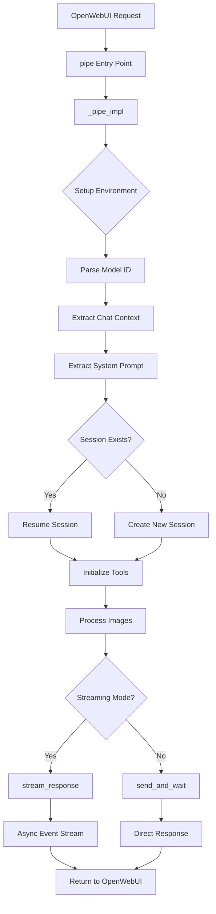

# GitHub Copilot SDK Integration Workflow

**Author:** Fu-Jie  
**Version:** 0.2.3  
**Last Updated:** 2026-01-27

---

## Table of Contents

1. [Architecture Overview](#architecture-overview)
2. [Request Processing Flow](#request-processing-flow)
3. [Session Management](#session-management)
4. [Streaming Response Handling](#streaming-response-handling)
5. [Event Processing Mechanism](#event-processing-mechanism)
6. [Tool Execution Flow](#tool-execution-flow)
7. [System Prompt Extraction](#system-prompt-extraction)
8. [Configuration Parameters](#configuration-parameters)
9. [Key Functions Reference](#key-functions-reference)

---

## Architecture Overview

### Component Diagram

```
┌─────────────────────────────────────────────────────────────┐
│                       OpenWebUI                              │
│  ┌───────────────────────────────────────────────────────┐  │
│  │              Pipe Interface (Entry Point)             │  │
│  └─────────────────────┬─────────────────────────────────┘  │
│                        │                                     │
│                        ▼                                     │
│  ┌───────────────────────────────────────────────────────┐  │
│  │           _pipe_impl (Main Logic)                     │  │
│  │  ┌──────────────────────────────────────────────────┐ │  │
│  │  │ 1. Environment Setup (_setup_env)               │ │  │
│  │  │ 2. Model Selection (request_model parsing)      │ │  │
│  │  │ 3. Chat Context Extraction                       │ │  │
│  │  │ 4. System Prompt Extraction                      │ │  │
│  │  │ 5. Session Management (create/resume)            │ │  │
│  │  │ 6. Streaming/Non-streaming Response              │ │  │
│  │  └──────────────────────────────────────────────────┘ │  │
│  └─────────────────────┬─────────────────────────────────┘  │
│                        │                                     │
│                        ▼                                     │
│  ┌───────────────────────────────────────────────────────┐  │
│  │           GitHub Copilot Client                       │  │
│  │  ┌──────────────────────────────────────────────────┐ │  │
│  │  │ • CopilotClient (SDK instance)                   │ │  │
│  │  │ • Session (conversation context)                 │ │  │
│  │  │ • Event Stream (async events)                    │ │  │
│  │  └──────────────────────────────────────────────────┘ │  │
│  └─────────────────────┬─────────────────────────────────┘  │
│                        │                                     │
└────────────────────────┼─────────────────────────────────────┘
                         ▼
              ┌──────────────────────┐
              │  Copilot CLI Process │
              │  (Backend Agent)     │
              └──────────────────────┘
```

### Key Components

1. **Pipe Interface**: OpenWebUI's standard entry point
2. **Environment Manager**: CLI setup, token validation, environment variables
3. **Session Manager**: Persistent conversation state with automatic compaction
4. **Event Processor**: Asynchronous streaming event handler
5. **Tool System**: Custom tool registration and execution
6. **Debug Logger**: Frontend console logging for troubleshooting

---

## Request Processing Flow

### Complete Request Lifecycle



### Step-by-Step Breakdown

#### 1. Environment Setup (`_setup_env`)

```python
def _setup_env(self, __event_call__=None):
    """
    Priority:
    1. Check VALVES.CLI_PATH
    2. Search system PATH
    3. Auto-install via curl (if not found)
    4. Set GH_TOKEN environment variables
    """
```

**Actions:**

- Locate Copilot CLI binary
- Set `COPILOT_CLI_PATH` environment variable
- Configure `GH_TOKEN` for authentication
- Apply custom environment variables

#### 2. Model Selection

```python
# Input: body["model"] = "copilotsdk-claude-sonnet-4.5"
request_model = body.get("model", "")
if request_model.startswith(f"{self.id}-"):
    real_model_id = request_model[len(f"{self.id}-"):]  # "claude-sonnet-4.5"
```

#### 3. Chat Context Extraction (`_get_chat_context`)

```python
# Priority order for chat_id:
# 1. __metadata__ (most reliable)
# 2. body["chat_id"]
# 3. body["metadata"]["chat_id"]
chat_ctx = self._get_chat_context(body, __metadata__, __event_call__)
chat_id = chat_ctx.get("chat_id")
```

#### 4. System Prompt Extraction (`_extract_system_prompt`)

Multi-source fallback strategy:

1. `metadata.model.params.system`
2. Model database lookup (by model_id)
3. `body.params.system`
4. Messages with `role="system"`

#### 5. Session Creation/Resumption

**New Session:**

```python
session_config = SessionConfig(
    session_id=chat_id,
    model=real_model_id,
    streaming=is_streaming,
    tools=custom_tools,
    system_message={"mode": "append", "content": system_prompt_content},
    infinite_sessions=InfiniteSessionConfig(
        enabled=True,
        background_compaction_threshold=0.8,
        buffer_exhaustion_threshold=0.95
    )
)
session = await client.create_session(config=session_config)
```

**Resume Session:**

```python
try:
    session = await client.resume_session(chat_id)
    # Session state preserved: history, tools, workspace
except Exception:
    # Fallback to creating new session
```

---

## Session Management

### Infinite Sessions Architecture

```
┌─────────────────────────────────────────────────────────┐
│              Session Lifecycle                          │
│                                                         │
│  ┌──────────┐  create   ┌──────────┐  resume  ┌───────┴───┐
│  │ Chat ID  │─────────▶ │ Session  │ ◀────────│  OpenWebUI │
│  └──────────┘           │  State   │          └───────────┘
│                         └─────┬────┘                       │
│                               │                            │
│                               ▼                            │
│  ┌─────────────────────────────────────────────────────┐  │
│  │          Context Window Management                  │  │
│  │  ┌──────────────────────────────────────────────┐  │  │
│  │  │ Messages [user, assistant, tool_results...]  │  │  │
│  │  │ Token Usage: ████████████░░░░ (80%)          │  │  │
│  │  └──────────────────────────────────────────────┘  │  │
│  │                      │                              │  │
│  │                      ▼                              │  │
│  │  ┌──────────────────────────────────────────────┐  │  │
│  │  │  Threshold Reached (0.8)                     │  │  │
│  │  │  → Background Compaction Triggered           │  │  │
│  │  └──────────────────────────────────────────────┘  │  │
│  │                      │                              │  │
│  │                      ▼                              │  │
│  │  ┌──────────────────────────────────────────────┐  │  │
│  │  │  Compacted Summary + Recent Messages         │  │  │
│  │  │  Token Usage: ██████░░░░░░░░░░░ (40%)        │  │  │
│  │  └──────────────────────────────────────────────┘  │  │
│  └─────────────────────────────────────────────────────┘  │
└─────────────────────────────────────────────────────────┘
```

### Configuration Parameters

```python
InfiniteSessionConfig(
    enabled=True,                              # Enable infinite sessions
    background_compaction_threshold=0.8,       # Start compaction at 80% token usage
    buffer_exhaustion_threshold=0.95           # Emergency threshold at 95%
)
```

**Behavior:**

- **< 80%**: Normal operation, no compaction
- **80-95%**: Background compaction (summarize older messages)
- **> 95%**: Force compaction before next request

---

## Streaming Response Handling

### Event-Driven Architecture

```python
async def stream_response(
    self, client, session, send_payload, init_message: str = "", __event_call__=None
) -> AsyncGenerator:
    """
    Asynchronous event processing with queue-based buffering.
    
    Flow:
    1. Start async send task
    2. Register event handler
    3. Process events via queue
    4. Yield chunks to OpenWebUI
    5. Clean up resources
    """
```

### Event Processing Pipeline

```
┌────────────────────────────────────────────────────────────┐
│              Copilot SDK Event Stream                      │
└────────────────────┬───────────────────────────────────────┘
                     │
                     ▼
        ┌────────────────────────┐
        │  Event Handler         │
        │  (Sync Callback)       │
        └────────┬───────────────┘
                 │
                 ▼
        ┌────────────────────────┐
        │  Async Queue           │
        │  (Thread-safe)         │
        └────────┬───────────────┘
                 │
                 ▼
        ┌────────────────────────┐
        │  Consumer Loop         │
        │  (async for)           │
        └────────┬───────────────┘
                 │
                 ▼
        ┌────────────────────────┐
        │  yield to OpenWebUI    │
        └────────────────────────┘
```

### State Management During Streaming

```python
state = {
    "thinking_started": False,   # <think> tags opened
    "content_sent": False        # Main content has started
}
active_tools = {}  # Track concurrent tool executions
```

**State Transitions:**

1. `reasoning_delta` arrives → `thinking_started = True` → Output: `<think>\n{reasoning}`
2. `message_delta` arrives → Close `</think>` if open → `content_sent = True` → Output: `{content}`
3. `tool.execution_start` → Output tool indicator (inside/outside `<think>`)
4. `session.complete` → Finalize stream

---

## Event Processing Mechanism

### Event Type Reference

Following official SDK patterns (from `copilot.SessionEventType`):

| Event Type | Description | Key Data Fields | Handler Action |
|-----------|-------------|-----------------|----------------|
| `assistant.message_delta` | Main content streaming | `delta_content` | Yield text chunk |
| `assistant.reasoning_delta` | Chain-of-thought | `delta_content` | Wrap in `<think>` tags |
| `tool.execution_start` | Tool call initiated | `name`, `tool_call_id` | Display tool indicator |
| `tool.execution_complete` | Tool finished | `result.content` | Show completion status |
| `session.compaction_start` | Context compaction begins | - | Log debug info |
| `session.compaction_complete` | Compaction done | - | Log debug info |
| `session.error` | Error occurred | `error`, `message` | Emit error notification |

### Event Handler Implementation

```python
def handler(event):
    """Process streaming events following official SDK patterns."""
    event_type = get_event_type(event)  # Handle enum/string types
    
    # Extract data using safe_get_data_attr (handles dict/object)
    if event_type == "assistant.message_delta":
        delta = safe_get_data_attr(event, "delta_content")
        if delta:
            queue.put_nowait(delta)  # Thread-safe enqueue
```

### Official SDK Pattern Compliance

```python
def safe_get_data_attr(event, attr: str, default=None):
    """
    Official pattern: event.data.delta_content
    Handles both dict and object access patterns.
    """
    if not hasattr(event, "data") or event.data is None:
        return default
    
    data = event.data
    
    # Dict access (JSON-like)
    if isinstance(data, dict):
        return data.get(attr, default)
    
    # Object attribute (Python SDK)
    return getattr(data, attr, default)
```

---

## Tool Execution Flow

### Tool Registration

```python
# 1. Define tool at module level
@define_tool(description="Generate a random integer within a specified range.")
async def generate_random_number(params: RandomNumberParams) -> str:
    number = random.randint(params.min, params.max)
    return f"Generated random number: {number}"

# 2. Register in _initialize_custom_tools
def _initialize_custom_tools(self):
    if not self.valves.ENABLE_TOOLS:
        return []
    
    all_tools = {
        "generate_random_number": generate_random_number,
    }
    
    # Filter based on AVAILABLE_TOOLS valve
    if self.valves.AVAILABLE_TOOLS == "all":
        return list(all_tools.values())
    
    enabled = [t.strip() for t in self.valves.AVAILABLE_TOOLS.split(",")]
    return [all_tools[name] for name in enabled if name in all_tools]
```

### Tool Execution Timeline

```
User Message: "Generate a random number between 1 and 100"
     │
     ▼
Model Decision: Use tool `generate_random_number`
     │
     ▼
Event: tool.execution_start
     │  → Display: "🔧 Running Tool: generate_random_number"
     ▼
Tool Function Execution (async)
     │
     ▼
Event: tool.execution_complete
     │  → Result: "Generated random number: 42"
     │  → Display: "✅ Tool Completed: 42"
     ▼
Model generates response using tool result
     │
     ▼
Event: assistant.message_delta
     │  → "I generated the number 42 for you."
     ▼
Stream Complete
```

### Visual Indicators

**Before Content:**

```markdown
<think>
Running Tool: generate_random_number...
Tool `generate_random_number` Completed. Result: 42
</think>

I generated the number 42 for you.
```

**After Content Started:**

```markdown
The number is

> 🔧 **Running Tool**: `generate_random_number`

> ✅ **Tool Completed**: 42

actually 42.
```

---

## System Prompt Extraction

### Multi-Source Priority System

```python
async def _extract_system_prompt(self, body, messages, request_model, real_model_id):
    """
    Priority order:
    1. metadata.model.params.system (highest)
    2. Model database lookup
    3. body.params.system
    4. messages[role="system"] (fallback)
    """
```

### Source 1: Metadata Model Params

```python
# OpenWebUI injects model configuration
metadata = body.get("metadata", {})
meta_model = metadata.get("model", {})
meta_params = meta_model.get("params", {})
system_prompt = meta_params.get("system")  # Priority 1
```

### Source 2: Model Database

```python
from open_webui.models.models import Models

# Try multiple model ID variations
model_ids_to_try = [
    request_model,                    # "copilotsdk-claude-sonnet-4.5"
    request_model.removeprefix(...),  # "claude-sonnet-4.5"
    real_model_id,                    # From valves
]

for mid in model_ids_to_try:
    model_record = Models.get_model_by_id(mid)
    if model_record and hasattr(model_record, "params"):
        system_prompt = model_record.params.get("system")
        if system_prompt:
            break
```

### Source 3: Body Params

```python
body_params = body.get("params", {})
system_prompt = body_params.get("system")
```

### Source 4: System Message

```python
for msg in messages:
    if msg.get("role") == "system":
        system_prompt = self._extract_text_from_content(msg.get("content"))
        break
```

### Configuration in SessionConfig

```python
system_message_config = {
    "mode": "append",           # Append to conversation context
    "content": system_prompt_content
}

session_config = SessionConfig(
    system_message=system_message_config,
    # ... other params
)
```

---

## Configuration Parameters

### Valve Definitions

| Parameter | Type | Default | Description |
|-----------|------|---------|-------------|
| `GH_TOKEN` | str | `""` | GitHub Fine-grained Token (requires 'Copilot Requests' permission) |
| `MODEL_ID` | str | `"claude-sonnet-4.5"` | Default model when dynamic fetching fails |
| `CLI_PATH` | str | `"/usr/local/bin/copilot"` | Path to Copilot CLI binary |
| `DEBUG` | bool | `False` | Enable frontend console debug logging |
| `LOG_LEVEL` | str | `"error"` | CLI log level: none, error, warning, info, debug, all |
| `SHOW_THINKING` | bool | `True` | Display model reasoning in `<think>` tags |
| `SHOW_WORKSPACE_INFO` | bool | `True` | Show session workspace path in debug mode |
| `EXCLUDE_KEYWORDS` | str | `""` | Comma-separated keywords to exclude models |
| `WORKSPACE_DIR` | str | `""` | Restricted workspace directory (empty = process cwd) |
| `INFINITE_SESSION` | bool | `True` | Enable automatic context compaction |
| `COMPACTION_THRESHOLD` | float | `0.8` | Background compaction at 80% token usage |
| `BUFFER_THRESHOLD` | float | `0.95` | Emergency threshold at 95% |
| `TIMEOUT` | int | `300` | Stream chunk timeout (seconds) |
| `CUSTOM_ENV_VARS` | str | `""` | JSON string of custom environment variables |
| `ENABLE_TOOLS` | bool | `False` | Enable custom tool system |
| `AVAILABLE_TOOLS` | str | `"all"` | Available tools: "all" or comma-separated list |

### Environment Variables

```bash
# Set by _setup_env
export COPILOT_CLI_PATH="/usr/local/bin/copilot"
export GH_TOKEN="ghp_xxxxxxxxxxxxxxxxxxxx"
export GITHUB_TOKEN="ghp_xxxxxxxxxxxxxxxxxxxx"

# Custom variables (from CUSTOM_ENV_VARS valve)
export CUSTOM_VAR_1="value1"
export CUSTOM_VAR_2="value2"
```

---

## Key Functions Reference

### Entry Points

#### `pipe(body, __metadata__, __event_emitter__, __event_call__)`

- **Purpose**: OpenWebUI stable entry point
- **Returns**: Delegates to `_pipe_impl`

#### `_pipe_impl(body, __metadata__, __event_emitter__, __event_call__)`

- **Purpose**: Main request processing logic
- **Flow**: Setup → Extract → Session → Response
- **Returns**: `str` (non-streaming) or `AsyncGenerator` (streaming)

#### `pipes()`

- **Purpose**: Dynamic model list fetching
- **Returns**: List of available models with multiplier info
- **Caching**: Uses `_model_cache` to avoid repeated API calls

### Session Management

#### `_build_session_config(chat_id, real_model_id, custom_tools, system_prompt_content, is_streaming)`

- **Purpose**: Construct SessionConfig object
- **Returns**: `SessionConfig` with infinite sessions and tools

#### `_get_chat_context(body, __metadata__, __event_call__)`

- **Purpose**: Extract chat_id with priority fallback
- **Returns**: `{"chat_id": str}`

### Streaming

#### `stream_response(client, session, send_payload, init_message, __event_call__)`

- **Purpose**: Async streaming event processor
- **Yields**: Text chunks to OpenWebUI
- **Resources**: Auto-cleanup client and session

#### `handler(event)`

- **Purpose**: Sync event callback (inside `stream_response`)
- **Action**: Parse event → Enqueue chunks → Update state

### Helpers

#### `_emit_debug_log(message, __event_call__)`

- **Purpose**: Send debug logs to frontend console
- **Condition**: Only when `DEBUG=True`

#### `_setup_env(__event_call__)`

- **Purpose**: Locate CLI, set environment variables
- **Side Effects**: Modifies `os.environ`

#### `_extract_system_prompt(body, messages, request_model, real_model_id, __event_call__)`

- **Purpose**: Multi-source system prompt extraction
- **Returns**: `(system_prompt_content, source_name)`

#### `_process_images(messages, __event_call__)`

- **Purpose**: Extract text and images from multimodal messages
- **Returns**: `(text_content, attachments_list)`

#### `_initialize_custom_tools()`

- **Purpose**: Register and filter custom tools
- **Returns**: List of tool functions

### Utility Functions

#### `get_event_type(event) -> str`

- **Purpose**: Extract event type string from enum/string
- **Handles**: `SessionEventType` enum → `.value` extraction

#### `safe_get_data_attr(event, attr: str, default=None)`

- **Purpose**: Safe attribute extraction from event.data
- **Handles**: Both dict access and object attribute access

---

## Troubleshooting Guide

### Enable Debug Mode

```python
# In OpenWebUI Valves UI:
DEBUG = True
SHOW_WORKSPACE_INFO = True
LOG_LEVEL = "debug"
```

### Debug Output Location

**Frontend Console:**

```javascript
// Open browser DevTools (F12)
// Look for logs with prefix: [Copilot Pipe]
console.debug("[Copilot Pipe] Extracted ChatID: abc123 (Source: __metadata__)")
```

**Backend Logs:**

```python
# Python logging output
logger.debug(f"[Copilot Pipe] Session resumed: {chat_id}")
```

### Common Issues

#### 1. Session Not Resuming

**Symptom:** New session created every request  
**Causes:**

- `chat_id` not extracted correctly
- Session expired on Copilot side
- `INFINITE_SESSION=False` (sessions not persistent)

**Solution:**

```python
# Check debug logs for:
"Extracted ChatID: <id> (Source: ...)"
"Session <id> not found (...), creating new."
```

#### 2. System Prompt Not Applied

**Symptom:** Model ignores configured system prompt  
**Causes:**

- Not found in any of 4 sources
- Session resumed (system prompt only set on creation)

**Solution:**

```python
# Check debug logs for:
"Extracted system prompt from <source> (length: X)"
"Configured system message (mode: append)"
```

#### 3. Tools Not Available

**Symptom:** Model can't use custom tools  
**Causes:**

- `ENABLE_TOOLS=False`
- Tool not registered in `_initialize_custom_tools`
- Wrong `AVAILABLE_TOOLS` filter

**Solution:**

```python
# Check debug logs for:
"Enabled X custom tools: ['tool1', 'tool2']"
```

---

## Performance Optimization

### Model List Caching

```python
# First request: Fetch from API
models = await client.list_models()
self._model_cache = [...]  # Cache result

# Subsequent requests: Use cache
if self._model_cache:
    return self._model_cache
```

### Session Persistence

**Impact:** Eliminates redundant model initialization on every request

```python
# Without session:
# Each request: Initialize model → Load context → Generate → Discard

# With session (chat_id):
# First request: Initialize model → Load context → Generate → Save
# Later: Resume → Generate (instant)
```

### Streaming vs Non-streaming

**Streaming:**

- Lower perceived latency (first token faster)
- Better UX for long responses
- Resource cleanup via generator exit

**Non-streaming:**

- Simpler error handling
- Atomic response (no partial output)
- Use for short responses

---

## Security Considerations

### Token Protection

```python
# ❌ Never log tokens
logger.debug(f"Token: {self.valves.GH_TOKEN}")  # DON'T DO THIS

# ✅ Mask sensitive data
logger.debug(f"Token configured: {'*' * 10}")
```

### Workspace Isolation

```python
# Set WORKSPACE_DIR to restrict file access
WORKSPACE_DIR = "/safe/sandbox/path"

# Copilot CLI respects this directory
client_config["cwd"] = WORKSPACE_DIR
```

### Input Validation

```python
# Validate chat_id format
if chat_id and not re.match(r'^[a-zA-Z0-9_-]+$', chat_id):
    logger.warning(f"Invalid chat_id format: {chat_id}")
    chat_id = None
```

---

## Future Enhancements

### Planned Features

1. **Multi-Session Management**: Support multiple parallel sessions per user
2. **Session Analytics**: Track token usage, compaction frequency
3. **Tool Result Caching**: Avoid redundant tool calls
4. **Custom Event Filters**: User-configurable event handling
5. **Workspace Templates**: Pre-configured workspace environments
6. **Streaming Abort**: Graceful cancellation of long-running requests

### API Evolution

Monitoring Copilot SDK updates for:

- New event types (e.g., `assistant.function_call`)
- Enhanced tool capabilities
- Improved session serialization

---

## References

- [GitHub Copilot SDK Documentation](https://github.com/github/copilot-sdk)
- [OpenWebUI Pipe Development](https://docs.openwebui.com/)
- [OpenWebUI Extensions Project](https://github.com/Fu-Jie/openwebui-extensions)

---

**License:** MIT  
**Maintainer:** Fu-Jie ([@Fu-Jie](https://github.com/Fu-Jie))
