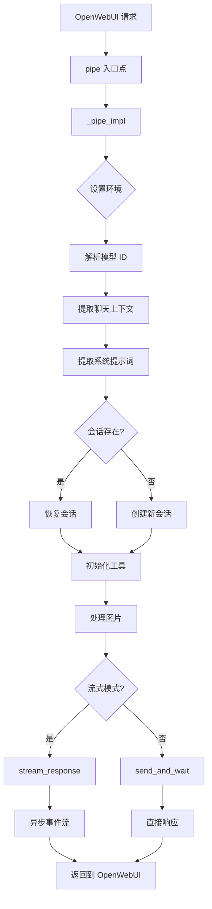

# GitHub Copilot SDK 集成工作流程

**作者：** Fu-Jie  
**版本：** 0.2.3  
**最后更新：** 2026-01-27

---

## 目录

1. [架构概览](#架构概览)
2. [请求处理流程](#请求处理流程)
3. [会话管理](#会话管理)
4. [流式响应处理](#流式响应处理)
5. [事件处理机制](#事件处理机制)
6. [工具执行流程](#工具执行流程)
7. [系统提示词提取](#系统提示词提取)
8. [配置参数](#配置参数)
9. [核心函数参考](#核心函数参考)

---

## 架构概览

### 组件图

```
┌─────────────────────────────────────────────────────────────┐
│                       OpenWebUI                              │
│  ┌───────────────────────────────────────────────────────┐  │
│  │              Pipe 接口 (入口点)                        │  │
│  └─────────────────────┬─────────────────────────────────┘  │
│                        │                                     │
│                        ▼                                     │
│  ┌───────────────────────────────────────────────────────┐  │
│  │           _pipe_impl (主逻辑)                         │  │
│  │  ┌──────────────────────────────────────────────────┐ │  │
│  │  │ 1. 环境设置 (_setup_env)                        │ │  │
│  │  │ 2. 模型选择 (request_model 解析)                │ │  │
│  │  │ 3. 聊天上下文提取                                │ │  │
│  │  │ 4. 系统提示词提取                                │ │  │
│  │  │ 5. 会话管理 (创建/恢复)                          │ │  │
│  │  │ 6. 流式/非流式响应                               │ │  │
│  │  └──────────────────────────────────────────────────┘ │  │
│  └─────────────────────┬─────────────────────────────────┘  │
│                        │                                     │
│                        ▼                                     │
│  ┌───────────────────────────────────────────────────────┐  │
│  │           GitHub Copilot 客户端                       │  │
│  │  ┌──────────────────────────────────────────────────┐ │  │
│  │  │ • CopilotClient (SDK 实例)                       │ │  │
│  │  │ • Session (对话上下文)                           │ │  │
│  │  │ • Event Stream (异步事件流)                      │ │  │
│  │  └──────────────────────────────────────────────────┘ │  │
│  └─────────────────────┬─────────────────────────────────┘  │
│                        │                                     │
└────────────────────────┼─────────────────────────────────────┘
                         ▼
              ┌──────────────────────┐
              │  Copilot CLI 进程    │
              │  (后端代理)          │
              └──────────────────────┘
```

### 核心组件

1. **Pipe 接口**：OpenWebUI 的标准入口点
2. **环境管理器**：CLI 设置、令牌验证、环境变量
3. **会话管理器**：持久化对话状态，自动压缩
4. **事件处理器**：异步流式事件处理器
5. **工具系统**：自定义工具注册和执行
6. **调试日志器**：前端控制台日志，用于故障排除

---

## 请求处理流程

### 完整请求生命周期



### 逐步分解

#### 1. 环境设置 (`_setup_env`)

```python
def _setup_env(self, __event_call__=None):
    """
    优先级：
    1. 检查 VALVES.CLI_PATH
    2. 搜索系统 PATH
    3. 自动通过 curl 安装（如果未找到）
    4. 设置 GH_TOKEN 环境变量
    """
```

**操作：**

- 定位 Copilot CLI 二进制文件
- 设置 `COPILOT_CLI_PATH` 环境变量
- 配置 `GH_TOKEN` 进行身份验证
- 应用自定义环境变量

#### 2. 模型选择

```python
# 输入：body["model"] = "copilotsdk-claude-sonnet-4.5"
request_model = body.get("model", "")
if request_model.startswith(f"{self.id}-"):
    real_model_id = request_model[len(f"{self.id}-"):]  # "claude-sonnet-4.5"
```

#### 3. 聊天上下文提取 (`_get_chat_context`)

```python
# chat_id 的优先级顺序：
# 1. __metadata__（最可靠）
# 2. body["chat_id"]
# 3. body["metadata"]["chat_id"]
chat_ctx = self._get_chat_context(body, __metadata__, __event_call__)
chat_id = chat_ctx.get("chat_id")
```

#### 4. 系统提示词提取 (`_extract_system_prompt`)

多源回退策略：

1. `metadata.model.params.system`
2. 模型数据库查询（按 model_id）
3. `body.params.system`
4. 包含 `role="system"` 的消息

#### 5. 会话创建/恢复

**新会话：**

```python
session_config = SessionConfig(
    session_id=chat_id,
    model=real_model_id,
    streaming=is_streaming,
    tools=custom_tools,
    system_message={"mode": "append", "content": system_prompt_content},
    infinite_sessions=InfiniteSessionConfig(
        enabled=True,
        background_compaction_threshold=0.8,
        buffer_exhaustion_threshold=0.95
    )
)
session = await client.create_session(config=session_config)
```

**恢复会话：**

```python
try:
    session = await client.resume_session(chat_id)
    # 会话状态保留：历史、工具、工作区
except Exception:
    # 回退到创建新会话
```

---

## 会话管理

### 无限会话架构

```
┌─────────────────────────────────────────────────────────┐
│              会话生命周期                                │
│                                                         │
│  ┌──────────┐  创建  ┌──────────┐  恢复   ┌───────────┐ │
│  │ Chat ID  │─────▶ │ Session  │ ◀────────│  OpenWebUI │ │
│  └──────────┘       │  State   │          └───────────┘ │
│                     └─────┬────┘                         │
│                           │                              │
│                           ▼                              │
│  ┌─────────────────────────────────────────────────┐    │
│  │          上下文窗口管理                          │    │
│  │  ┌──────────────────────────────────────────┐  │    │
│  │  │ 消息 [user, assistant, tool_results...]  │  │    │
│  │  │ Token 使用率: ████████████░░░░ (80%)     │  │    │
│  │  └──────────────────────────────────────────┘  │    │
│  │                      │                          │    │
│  │                      ▼                          │    │
│  │  ┌──────────────────────────────────────────┐  │    │
│  │  │  达到阈值 (0.8)                          │  │    │
│  │  │  → 后台压缩触发                          │  │    │
│  │  └──────────────────────────────────────────┘  │    │
│  │                      │                          │    │
│  │                      ▼                          │    │
│  │  ┌──────────────────────────────────────────┐  │    │
│  │  │  压缩摘要 + 最近消息                     │  │    │
│  │  │  Token 使用率: ██████░░░░░░░░░░░ (40%)  │  │    │
│  │  └──────────────────────────────────────────┘  │    │
│  └─────────────────────────────────────────────────┘    │
└─────────────────────────────────────────────────────────┘
```

### 配置参数

```python
InfiniteSessionConfig(
    enabled=True,                              # 启用无限会话
    background_compaction_threshold=0.8,       # 在 80% token 使用率时开始压缩
    buffer_exhaustion_threshold=0.95           # 95% 紧急阈值
)
```

**行为：**

- **< 80%**：正常操作，无压缩
- **80-95%**：后台压缩（总结旧消息）
- **> 95%**：在下一个请求前强制压缩

---

## 流式响应处理

### 事件驱动架构

```python
async def stream_response(
    self, client, session, send_payload, init_message: str = "", __event_call__=None
) -> AsyncGenerator:
    """
    使用基于队列的缓冲进行异步事件处理。
    
    流程：
    1. 启动异步发送任务
    2. 注册事件处理器
    3. 通过队列处理事件
    4. 向 OpenWebUI 产出块
    5. 清理资源
    """
```

### 事件处理管道

```
┌────────────────────────────────────────────────────────────┐
│              Copilot SDK 事件流                            │
└────────────────────┬───────────────────────────────────────┘
                     │
                     ▼
        ┌────────────────────────┐
        │  事件处理器            │
        │  (同步回调)            │
        └────────┬───────────────┘
                 │
                 ▼
        ┌────────────────────────┐
        │  异步队列              │
        │  (线程安全)            │
        └────────┬───────────────┘
                 │
                 ▼
        ┌────────────────────────┐
        │  消费者循环            │
        │  (async for)           │
        └────────┬───────────────┘
                 │
                 ▼
        ┌────────────────────────┐
        │  yield 到 OpenWebUI    │
        └────────────────────────┘
```

### 流式传输期间的状态管理

```python
state = {
    "thinking_started": False,   # <think> 标签已打开
    "content_sent": False        # 主内容已开始
}
active_tools = {}  # 跟踪并发工具执行
```

**状态转换：**

1. `reasoning_delta` 到达 → `thinking_started = True` → 输出：`<think>\n{reasoning}`
2. `message_delta` 到达 → 如果打开则关闭 `</think>` → `content_sent = True` → 输出：`{content}`
3. `tool.execution_start` → 输出工具指示器（在 `<think>` 内部/外部）
4. `session.complete` → 完成流

---

## 事件处理机制

### 事件类型参考

遵循官方 SDK 模式（来自 `copilot.SessionEventType`）：

| 事件类型 | 描述 | 关键数据字段 | 处理器操作 |
|---------|------|-------------|-----------|
| `assistant.message_delta` | 主内容流式传输 | `delta_content` | 产出文本块 |
| `assistant.reasoning_delta` | 思维链 | `delta_content` | 用 `<think>` 标签包装 |
| `tool.execution_start` | 工具调用启动 | `name`, `tool_call_id` | 显示工具指示器 |
| `tool.execution_complete` | 工具完成 | `result.content` | 显示完成状态 |
| `session.compaction_start` | 上下文压缩开始 | - | 记录调试信息 |
| `session.compaction_complete` | 压缩完成 | - | 记录调试信息 |
| `session.error` | 发生错误 | `error`, `message` | 发出错误通知 |

### 事件处理器实现

```python
def handler(event):
    """遵循官方 SDK 模式处理流式事件。"""
    event_type = get_event_type(event)  # 处理枚举/字符串类型
    
    # 使用 safe_get_data_attr 提取数据（处理 dict/object）
    if event_type == "assistant.message_delta":
        delta = safe_get_data_attr(event, "delta_content")
        if delta:
            queue.put_nowait(delta)  # 线程安全入队
```

### 官方 SDK 模式合规性

```python
def safe_get_data_attr(event, attr: str, default=None):
    """
    官方模式：event.data.delta_content
    处理 dict 和对象访问模式。
    """
    if not hasattr(event, "data") or event.data is None:
        return default
    
    data = event.data
    
    # Dict 访问（类似 JSON）
    if isinstance(data, dict):
        return data.get(attr, default)
    
    # 对象属性（Python SDK）
    return getattr(data, attr, default)
```

---

## 工具执行流程

### 工具注册

```python
# 1. 在模块级别定义工具
@define_tool(description="在指定范围内生成随机整数。")
async def generate_random_number(params: RandomNumberParams) -> str:
    number = random.randint(params.min, params.max)
    return f"生成的随机数: {number}"

# 2. 在 _initialize_custom_tools 中注册
def _initialize_custom_tools(self):
    if not self.valves.ENABLE_TOOLS:
        return []
    
    all_tools = {
        "generate_random_number": generate_random_number,
    }
    
    # 根据 AVAILABLE_TOOLS valve 过滤
    if self.valves.AVAILABLE_TOOLS == "all":
        return list(all_tools.values())
    
    enabled = [t.strip() for t in self.valves.AVAILABLE_TOOLS.split(",")]
    return [all_tools[name] for name in enabled if name in all_tools]
```

### 工具执行时间线

```
用户消息：生成一个 1 到 100 之间的随机数
     │
     ▼
模型决策：使用工具 `generate_random_number`
     │
     ▼
事件：tool.execution_start
     │  → 显示："🔧 运行工具：generate_random_number"
     ▼
工具函数执行（异步）
     │
     ▼
事件：tool.execution_complete
     │  → 结果："生成的随机数：42"
     │  → 显示："✅ 工具完成：42"
     ▼
模型使用工具结果生成响应
     │
     ▼
事件：assistant.message_delta
     │  → "我为你生成了数字 42。"
     ▼
流完成
```

### 视觉指示器

**内容前：**

```markdown
<think>
运行工具：generate_random_number...
工具 `generate_random_number` 完成。结果：42
</think>

我为你生成了数字 42。
```

**内容开始后：**

```markdown
数字是

> 🔧 **运行工具**：`generate_random_number`

> ✅ **工具完成**：42

实际上是 42。
```

---

## 系统提示词提取

### 多源优先级系统

```python
async def _extract_system_prompt(self, body, messages, request_model, real_model_id):
    """
    优先级顺序：
    1. metadata.model.params.system（最高）
    2. 模型数据库查询
    3. body.params.system
    4. messages[role="system"]（回退）
    """
```

### 来源 1：元数据模型参数

```python
# OpenWebUI 注入模型配置
metadata = body.get("metadata", {})
meta_model = metadata.get("model", {})
meta_params = meta_model.get("params", {})
system_prompt = meta_params.get("system")  # 优先级 1
```

### 来源 2：模型数据库

```python
from open_webui.models.models import Models

# 尝试多个模型 ID 变体
model_ids_to_try = [
    request_model,                    # "copilotsdk-claude-sonnet-4.5"
    request_model.removeprefix(...),  # "claude-sonnet-4.5"
    real_model_id,                    # 来自 valves
]

for mid in model_ids_to_try:
    model_record = Models.get_model_by_id(mid)
    if model_record and hasattr(model_record, "params"):
        system_prompt = model_record.params.get("system")
        if system_prompt:
            break
```

### 来源 3：Body 参数

```python
body_params = body.get("params", {})
system_prompt = body_params.get("system")
```

### 来源 4：系统消息

```python
for msg in messages:
    if msg.get("role") == "system":
        system_prompt = self._extract_text_from_content(msg.get("content"))
        break
```

### SessionConfig 中的配置

```python
system_message_config = {
    "mode": "append",           # 追加到对话上下文
    "content": system_prompt_content
}

session_config = SessionConfig(
    system_message=system_message_config,
    # ... 其他参数
)
```

---

## 配置参数

### Valve 定义

| 参数 | 类型 | 默认值 | 描述 |
|-----|------|--------|------|
| `GH_TOKEN` | str | `""` | GitHub 精细化令牌（需要 'Copilot Requests' 权限） |
| `MODEL_ID` | str | `"claude-sonnet-4.5"` | 动态获取失败时的默认模型 |
| `CLI_PATH` | str | `"/usr/local/bin/copilot"` | Copilot CLI 二进制文件路径 |
| `DEBUG` | bool | `False` | 启用前端控制台调试日志 |
| `LOG_LEVEL` | str | `"error"` | CLI 日志级别：none、error、warning、info、debug、all |
| `SHOW_THINKING` | bool | `True` | 在 `<think>` 标签中显示模型推理 |
| `SHOW_WORKSPACE_INFO` | bool | `True` | 在调试模式下显示会话工作区路径 |
| `EXCLUDE_KEYWORDS` | str | `""` | 逗号分隔的关键字，用于排除模型 |
| `WORKSPACE_DIR` | str | `""` | 限制的工作区目录（空 = 进程 cwd） |
| `INFINITE_SESSION` | bool | `True` | 启用自动上下文压缩 |
| `COMPACTION_THRESHOLD` | float | `0.8` | 80% token 使用率时后台压缩 |
| `BUFFER_THRESHOLD` | float | `0.95` | 95% 紧急阈值 |
| `TIMEOUT` | int | `300` | 流块超时（秒） |
| `CUSTOM_ENV_VARS` | str | `""` | 自定义环境变量的 JSON 字符串 |
| `ENABLE_TOOLS` | bool | `False` | 启用自定义工具系统 |
| `AVAILABLE_TOOLS` | str | `"all"` | 可用工具："all" 或逗号分隔列表 |

### 环境变量

```bash
# 由 _setup_env 设置
export COPILOT_CLI_PATH="/usr/local/bin/copilot"
export GH_TOKEN="ghp_xxxxxxxxxxxxxxxxxxxx"
export GITHUB_TOKEN="ghp_xxxxxxxxxxxxxxxxxxxx"

# 自定义变量（来自 CUSTOM_ENV_VARS valve）
export CUSTOM_VAR_1="value1"
export CUSTOM_VAR_2="value2"
```

---

## 核心函数参考

### 入口点

#### `pipe(body, __metadata__, __event_emitter__, __event_call__)`

- **目的**：OpenWebUI 稳定入口点
- **返回**：委托给 `_pipe_impl`

#### `_pipe_impl(body, __metadata__, __event_emitter__, __event_call__)`

- **目的**：主请求处理逻辑
- **流程**：设置 → 提取 → 会话 → 响应
- **返回**：`str`（非流式）或 `AsyncGenerator`（流式）

#### `pipes()`

- **目的**：动态模型列表获取
- **返回**：带有倍数信息的可用模型列表
- **缓存**：使用 `_model_cache` 避免重复 API 调用

### 会话管理

#### `_build_session_config(chat_id, real_model_id, custom_tools, system_prompt_content, is_streaming)`

- **目的**：构建 SessionConfig 对象
- **返回**：带有无限会话和工具的 `SessionConfig`

#### `_get_chat_context(body, __metadata__, __event_call__)`

- **目的**：使用优先级回退提取 chat_id
- **返回**：`{"chat_id": str}`

### 流式传输

#### `stream_response(client, session, send_payload, init_message, __event_call__)`

- **目的**：异步流式事件处理器
- **产出**：文本块到 OpenWebUI
- **资源**：自动清理客户端和会话

#### `handler(event)`

- **目的**：同步事件回调（在 `stream_response` 内）
- **操作**：解析事件 → 入队块 → 更新状态

### 辅助函数

#### `_emit_debug_log(message, __event_call__)`

- **目的**：将调试日志发送到前端控制台
- **条件**：仅当 `DEBUG=True` 时

#### `_setup_env(__event_call__)`

- **目的**：定位 CLI，设置环境变量
- **副作用**：修改 `os.environ`

#### `_extract_system_prompt(body, messages, request_model, real_model_id, __event_call__)`

- **目的**：多源系统提示词提取
- **返回**：`(system_prompt_content, source_name)`

#### `_process_images(messages, __event_call__)`

- **目的**：从多模态消息中提取文本和图片
- **返回**：`(text_content, attachments_list)`

#### `_initialize_custom_tools()`

- **目的**：注册和过滤自定义工具
- **返回**：工具函数列表

### 实用函数

#### `get_event_type(event) -> str`

- **目的**：从枚举/字符串提取事件类型字符串
- **处理**：`SessionEventType` 枚举 → `.value` 提取

#### `safe_get_data_attr(event, attr: str, default=None)`

- **目的**：从 event.data 安全提取属性
- **处理**：dict 访问和对象属性访问

---

## 故障排除指南

### 启用调试模式

```python
# 在 OpenWebUI Valves UI 中：
DEBUG = True
SHOW_WORKSPACE_INFO = True
LOG_LEVEL = "debug"
```

### 调试输出位置

**前端控制台：**

```javascript
// 打开浏览器开发工具 (F12)
// 查找前缀为 [Copilot Pipe] 的日志
console.debug("[Copilot Pipe] 提取的 ChatID：abc123（来源：__metadata__）")
```

**后端日志：**

```python
# Python 日志输出
logger.debug(f"[Copilot Pipe] 会话已恢复：{chat_id}")
```

### 常见问题

#### 1. 会话未恢复

**症状**：每次请求都创建新会话  
**原因**：

- `chat_id` 提取不正确
- Copilot 端会话过期
- `INFINITE_SESSION=False`（会话不持久）

**解决方案**：

```python
# 检查调试日志中的：
"提取的 ChatID：<id>（来源：...）"
"会话 <id> 未找到（...），正在创建新会话。"
```

#### 2. 系统提示词未应用

**症状**：模型忽略配置的系统提示词  
**原因**：

- 在 4 个来源中均未找到
- 会话已恢复（系统提示词仅在创建时设置）

**解决方案**：

```python
# 检查调试日志中的：
"从 <source> 提取系统提示词（长度：X）"
"配置系统消息（模式：append）"
```

#### 3. 工具不可用

**症状**：模型无法使用自定义工具  
**原因**：

- `ENABLE_TOOLS=False`
- 工具未在 `_initialize_custom_tools` 中注册
- 错误的 `AVAILABLE_TOOLS` 过滤器

**解决方案**：

```python
# 检查调试日志中的：
"已启用 X 个自定义工具：['tool1', 'tool2']"
```

---

## 性能优化

### 模型列表缓存

```python
# 第一次请求：从 API 获取
models = await client.list_models()
self._model_cache = [...]  # 缓存结果

# 后续请求：使用缓存
if self._model_cache:
    return self._model_cache
```

### 会话持久化

**影响**：消除每次请求的冗余模型初始化

```python
# 没有会话：
# 每次请求：初始化模型 → 加载上下文 → 生成 → 丢弃

# 有会话（chat_id）：
# 第一次请求：初始化模型 → 加载上下文 → 生成 → 保存
# 后续：恢复 → 生成（即时）
```

### 流式 vs 非流式

**流式：**

- 降低感知延迟（首个 token 更快）
- 长响应的更好用户体验
- 通过生成器退出进行资源清理

**非流式：**

- 更简单的错误处理
- 原子响应（无部分输出）
- 用于短响应

---

## 安全考虑

### 令牌保护

```python
# ❌ 永远不要记录令牌
logger.debug(f"令牌：{self.valves.GH_TOKEN}")  # 不要这样做

# ✅ 屏蔽敏感数据
logger.debug(f"令牌已配置：{'*' * 10}")
```

### 工作区隔离

```python
# 设置 WORKSPACE_DIR 以限制文件访问
WORKSPACE_DIR = "/safe/sandbox/path"

# Copilot CLI 遵守此目录
client_config["cwd"] = WORKSPACE_DIR
```

### 输入验证

```python
# 验证 chat_id 格式
if chat_id and not re.match(r'^[a-zA-Z0-9_-]+$', chat_id):
    logger.warning(f"无效的 chat_id 格式：{chat_id}")
    chat_id = None
```

---

## 未来增强

### 计划功能

1. **多会话管理**：支持每个用户的多个并行会话
2. **会话分析**：跟踪 token 使用率、压缩频率
3. **工具结果缓存**：避免冗余工具调用
4. **自定义事件过滤器**：用户可配置的事件处理
5. **工作区模板**：预配置的工作区环境
6. **流式中止**：优雅取消长时间运行的请求

### API 演进

监控 Copilot SDK 更新：

- 新事件类型（例如 `assistant.function_call`）
- 增强的工具功能
- 改进的会话序列化

---

## 参考资料

- [GitHub Copilot SDK 文档](https://github.com/github/copilot-sdk)
- [OpenWebUI Pipe 开发](https://docs.openwebui.com/)
- [Awesome OpenWebUI 项目](https://github.com/Fu-Jie/awesome-openwebui)

---

**许可证**：MIT  
**维护者**：Fu-Jie ([@Fu-Jie](https://github.com/Fu-Jie))
