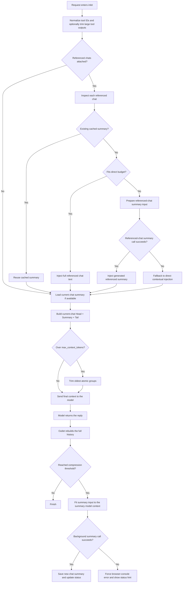

# Async Context Compression: A Production-Scale Working-Memory Filter for OpenWebUI

Long chats do not just get expensive. They also get fragile.

Once a conversation grows large enough, you usually have to choose between two bad options:

- keep the full history and pay a heavy context cost
- trim aggressively and risk losing continuity, tool state, or important prior decisions

`Async Context Compression` is built to avoid that tradeoff.

It is not a simple “summarize old messages” utility. It is a structure-aware, async, database-backed working-memory system for OpenWebUI that can compress long conversations while preserving conversational continuity, tool-calling integrity, and now, as of `v1.5.0`, referenced-chat context injection as well.

This plugin has now reached the point where it feels complete enough to be described as a serious, high-capability filter rather than a small convenience add-on.

**[📖 Full README](https://github.com/Fu-Jie/openwebui-extensions/blob/main/plugins/filters/async-context-compression/README.md)**  
**[📝 v1.5.0 Release Notes](https://github.com/Fu-Jie/openwebui-extensions/blob/main/plugins/filters/async-context-compression/v1.5.0.md)**

---

## Why This Plugin Exists

OpenWebUI conversations often contain much more than plain chat:

- long-running planning threads
- coding sessions with repeated tool use
- model-specific context limits
- multimodal messages
- external referenced chats
- custom models with different context windows

A naive compression strategy is not enough in those environments.

If a filter only drops earlier messages based on length, it can:

- break native tool-calling chains
- lose critical task state
- destroy continuity in old chats
- make debugging impossible
- hide important provider-side failures

`Async Context Compression` is designed around a stronger premise:

> compress history without treating conversation structure as disposable

That means it tries to preserve what actually matters for the next turn:

- the current goal
- durable user preferences
- recent progress
- tool outputs that still matter
- error state
- summary continuity
- referenced context from other chats

---

## What Makes It Different

This plugin now combines several capabilities that are usually split across separate systems:

### 1. Asynchronous working-memory generation

The current reply is not blocked while the plugin generates a new summary in the background.

### 2. Persistent summary storage

Summaries are stored in OpenWebUI's shared database and reused across turns, instead of being regenerated from scratch every time.

### 3. Structure-aware trimming

The filter respects atomic message boundaries so native tool-calling history is not corrupted by compression.

### 4. External chat reference summarization

New in `v1.5.0`: referenced chats can now be reused as cached summaries, injected directly if small enough, or summarized before injection if too large.

### 5. Mixed-script token estimation

The plugin now uses a much stronger multilingual token estimation path before falling back to exact counting, which helps reduce unnecessary expensive token calculations while staying much closer to real usage.

### 6. Real failure visibility

Important background summary failures are surfaced to the browser console and status messages instead of disappearing silently.

---

## Workflow Overview

This is the current high-level flow:

This is why I consider the plugin “powerful” now: it is no longer solving a single problem. It is coordinating context reduction, summary persistence, tool safety, referenced-chat handling, and model-budget control inside one filter.

---

## New in v1.5.0

This release is important because it turns the plugin from “long-chat compression with strong tool safety” into something closer to a reusable context-management layer.

### External chat reference summaries

This is a new feature in `v1.5.0`, not just a small adjustment.

When a user references another chat:

- the plugin can reuse an existing cached summary
- inject the full referenced chat if it is small enough
- or generate a summary first if the referenced chat is too large

That means the filter can now carry relevant context across chats, not just across turns inside the same chat.

### Fast multilingual token estimation

Also new in `v1.5.0`.

The plugin no longer relies on a rough one-size-fits-all character ratio. It now estimates token usage with mixed-script heuristics that behave much better for:

- English
- Chinese
- Japanese
- Korean
- Cyrillic
- Arabic
- Thai
- mixed-language conversations

This matters because the plugin makes context decisions constantly. Better estimation means fewer unnecessary exact counts and fewer bad preflight assumptions.

### Stronger final-prompt budgeting

The summary path now fits the **real final summary request**, not just an intermediate estimate. That includes:

- prompt wrapper
- formatted conversation text
- previous summary
- reserved output budget
- safety margin

This directly improves reliability in the large old-chat cases that are hardest to handle.

---

## Why It Feels Complete Now

I would describe the current plugin as “feature-complete for the main problem space,” because it now covers the major operational surfaces that matter in real usage:

- long plain-chat conversations
- multi-step coding threads
- native tool-calling conversations
- persistent summaries
- custom model thresholds
- background async generation
- external chat references
- multilingual token estimation
- failure surfacing for debugging

That does not mean it is finished forever. It means the plugin has crossed the line from a narrow experimental filter into a robust context-management system with enough breadth to support demanding OpenWebUI usage patterns.

---

## Scale and Engineering Depth

For people who care about implementation depth, this plugin is not small anymore.

Current code size:

- main plugin: **4,573 lines**
- focused test file: **1,037 lines**
- combined visible implementation + regression coverage: **5,610 lines**

Line count is not a quality metric by itself, but at this scale it does say something real:

- the plugin has grown well beyond a toy filter
- the behavior surface is large enough to require explicit regression testing
- the plugin now encodes a lot of edge-case handling that only shows up after repeated real-world usage

In other words: this is no longer “just summarize old messages.” It is a fairly serious stateful filter.

---

## Practical Benefits

If you use OpenWebUI heavily, the value is straightforward:

- lower token consumption in long chats
- better continuity across long-running sessions
- safer native tool-calling history
- fewer broken conversations after compression
- more stable summary generation on large histories
- better visibility when the provider rejects a summary request
- useful reuse of context from referenced chats

This plugin is especially valuable if you:

- regularly work in long coding chats
- use models with strict context budgets
- rely on native tool calling
- revisit old project chats
- want summaries to behave like working memory, not like lossy notes

---

## Installation

- OpenWebUI Community: <https://openwebui.com/posts/async_context_compression_b1655bc8>
- Source: <https://github.com/Fu-Jie/openwebui-extensions/tree/main/plugins/filters/async-context-compression>

If you want the full valve list, deployment notes, and troubleshooting details, the README is the best reference.

---

## Final Note

Do I think this plugin is powerful?

Yes, genuinely.

Not because it is large, but because it now solves the right combination of problems at once:

- cost control
- continuity
- structural safety
- async persistence
- cross-chat reuse
- operational debuggability

That combination is what makes it feel strong.

If you have been looking for a serious long-conversation memory/compression filter for OpenWebUI, `Async Context Compression` is now in that category.
