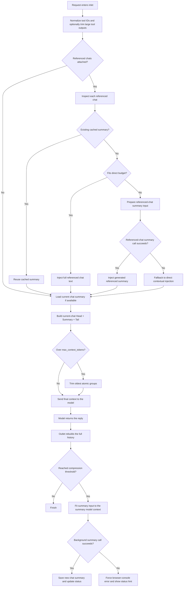

# Async Context Compression：一个面向生产场景的 OpenWebUI 工作记忆过滤器

长对话的问题，从来不只是“贵”。

当聊天足够长时，通常只剩下两个都不太好的选择：

- 保留完整历史，继续承担很高的上下文成本
- 粗暴裁剪旧消息，但冒着丢失上下文、工具状态和关键决策的风险

`Async Context Compression` 的目标，就是尽量避免这个二选一。

它不是一个简单的“把老消息总结一下”的小工具，而是一个带有结构感知、异步摘要、数据库持久化能力的 OpenWebUI 工作记忆系统。它的任务不是单纯缩短上下文，而是在压缩长对话的同时，尽量保留：

- 对话连续性
- 工具调用状态完整性
- 历史摘要进度
- 跨聊天引用上下文
- 出错时的可诊断性

到 `v1.5.0` 这个阶段，我认为它已经不再只是一个“方便的小过滤器”，而是一个足够完整、足够强、也足够有工程深度的上下文管理插件。

**[📖 完整 README](https://github.com/Fu-Jie/openwebui-extensions/blob/main/plugins/filters/async-context-compression/README_CN.md)**  
**[📝 v1.5.0 发布说明](https://github.com/Fu-Jie/openwebui-extensions/blob/main/plugins/filters/async-context-compression/v1.5.0_CN.md)**

---

## 为什么会有这个插件

OpenWebUI 里的真实对话，通常并不只是“用户问一句，模型答一句”。

它常常还包含：

- 很长的项目型对话
- 多轮编码与调试
- 原生工具调用
- 多模态消息
- 不同模型上下文窗口差异
- 其他聊天的引用上下文

在这种环境里，单纯靠“按长度裁掉旧消息”其实不够。

如果一个过滤器只会按长度或索引裁剪消息，它很容易：

- 把原生 tool-calling 历史裁坏
- 丢掉仍然会影响下一轮回复的关键信息
- 在老聊天里破坏连续性
- 出问题时几乎无法排查
- 把上游 provider 报错伪装成模糊的内部错误

`Async Context Compression` 的核心思路更强一些：

> 可以压缩历史，但不能把“对话结构”当成无关紧要的东西一起压掉

它真正想保留的是下一轮最需要的状态：

- 当前目标
- 持久偏好
- 最近进展
- 仍然有效的工具结果
- 错误状态
- 已有摘要的连续性
- 来自其他聊天的相关上下文

---

## 它和普通摘要插件有什么不同

现在这个插件，实际上已经把几个通常要分散在不同系统里的能力组合到了一起：

### 1. 异步工作记忆生成

用户当前这次回复不会被后台摘要阻塞。

### 2. 持久化摘要存储

摘要会写入 OpenWebUI 共享数据库，并在后续轮次中复用，而不是每次都从头重算。

### 3. 结构感知裁剪

裁剪逻辑会尊重原子消息边界，避免把原生 tool-calling 历史裁坏。

### 4. 外部聊天引用摘要

这是 `v1.5.0` 新增的重要能力：被引用聊天现在可以直接复用缓存摘要、在小体量时直接注入、或者在过大时先生成摘要再注入。

### 5. 多语言 Token 预估

插件现在具备更强的多脚本文本 Token 预估逻辑，在很多情况下可以减少不必要的精确计数，同时明显比旧的粗略字符比值更贴近真实用量。

### 6. 失败可见性

关键的后台摘要失败现在会出现在浏览器控制台和状态提示里，不再悄悄消失。

---

## 工作流总览

下面是当前的高层流程：

这也是为什么我会觉得它现在“强”：它已经不再只解决一个问题，而是在一个过滤器里同时协调：

- 上下文压缩
- 历史摘要复用
- 工具调用安全性
- 被引用聊天上下文
- 模型预算控制

---

## v1.5.0 为什么重要

这个版本的重要性在于，它把插件从“长对话压缩器”推进成了一个更接近“上下文管理层”的东西。

### 外部聊天引用摘要

这是 `v1.5.0` 的新功能，不是小修小补。

当用户引用另一个聊天时，插件现在可以：

- 直接复用已有缓存摘要
- 如果聊天足够小，直接把完整内容注入
- 如果聊天太大，先生成摘要再注入

这意味着它现在不仅能跨“轮次”保留上下文，也能开始跨“聊天”携带相关上下文。

### 快速多语言 Token 预估

这同样是 `v1.5.0` 的新能力。

插件不再依赖简单粗暴的统一字符比值，而是改用更适合混合语言文本的估算方式，尤其对下面这些场景更有意义：

- 英文
- 中文
- 日文
- 韩文
- 西里尔字符
- 阿拉伯语
- 泰语
- 中英混合或多语言混合对话

这很重要，因为上下文管理类插件会不断做预算判断。预估更准，就意味着更少无意义的精确计算，也更不容易在预检阶段做出错误判断。

### 更强的最终请求预算控制

现在的摘要路径会去拟合“真实最终 summary request”，而不是只看一个中间估算值。它会把这些内容都算进去：

- prompt 包装
- 格式化后的对话文本
- previous summary
- 预留输出预算
- 安全余量

这对老聊天、大聊天和最难处理的边界情况特别关键。

---

## 为什么我觉得它现在已经足够完整

如果把“问题空间”列出来，我会说这个插件现在对主要场景已经覆盖得比较完整了：

- 很长的普通聊天
- 多轮编码与调试对话
- 原生工具调用
- 历史摘要持久化
- 自定义模型阈值
- 异步后台摘要
- 外部聊天引用
- 多语言 Token 预估
- 调试可见性

这并不代表它永远不会再迭代，而是说它已经越过了“窄功能实验品”的阶段，进入了一个更像“通用上下文管理系统”的形态。

---

## 代码规模与工程深度

如果你关心实现深度，这个插件现在已经不小了。

当前代码规模：

- 主插件文件：**4,573 行**
- 聚焦测试文件：**1,037 行**
- 可见实现 + 回归测试合计：**5,610 行**

代码行数本身不等于质量，但在这个量级上，它至少说明了几件真实的事：

- 这已经不是一个玩具级过滤器
- 这个插件的行为面足够大，必须靠专门回归测试兜住
- 它已经积累了很多只有在真实使用中才会暴露出来的边界处理逻辑

也就是说，它现在做的事情，已经明显不是“把老消息总结一下”那么简单。

---

## 实际价值

如果你是 OpenWebUI 的重度用户，这个插件的价值其实很直接：

- 长聊天更省 Token
- 长会话连续性更好
- 原生 tool-calling 更安全
- 压缩后更不容易把会话搞坏
- 大历史摘要生成更稳定
- provider 拒绝摘要请求时更容易看到真错误
- 能复用其他聊天里的有效上下文

尤其适合这些用户：

- 经常做长时间编码聊天
- 使用上下文窗口比较紧的模型
- 依赖原生工具调用
- 经常回看旧项目聊天
- 希望摘要更像“工作记忆”而不是“丢失细节的简要笔记”

---

## 安装

- OpenWebUI 社区：<https://openwebui.com/posts/async_context_compression_b1655bc8>
- 源码目录：<https://github.com/Fu-Jie/openwebui-extensions/tree/main/plugins/filters/async-context-compression>

如果你想看完整的 valves、部署说明和故障排查，README 仍然是最完整的参考入口。

---

## 最后一句

你问我这个插件是不是强大。

我的答案是：**是，确实强，而且现在已经不是“看起来强”，而是“问题空间覆盖得比较完整”的那种强。**

不是因为它代码多，而是因为它现在同时解决的是一组真正相关的问题：

- 成本控制
- 连续性
- 结构安全
- 异步持久化
- 跨聊天上下文复用
- 出错时的可诊断性

正是这几个东西一起成立，才让它现在像一个真正成熟的长对话上下文管理插件。
