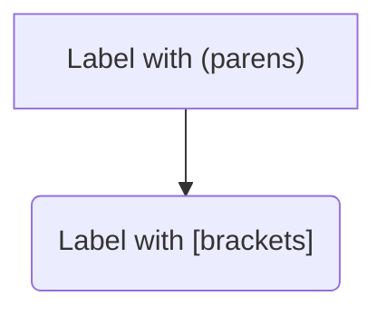
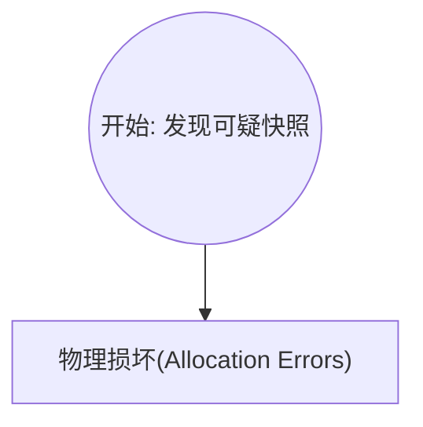
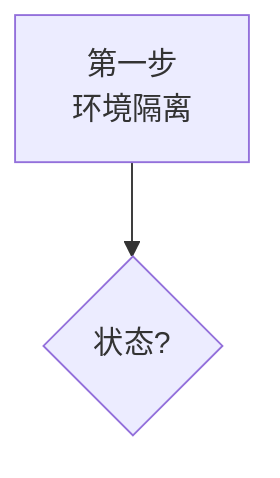

# Markdown Normalizer 功能详解

本插件旨在修复 LLM 输出中常见的 Markdown 格式问题，确保在 Open WebUI 中完美渲染。以下是支持的修复功能列表及示例。

## 1. 代码块修复 (Code Block Fixes)

### 1.1 去除代码块缩进
LLM 有时会在代码块前添加空格缩进，导致渲染失效。本插件会自动移除这些缩进。

**Before:**
   ```python
   print("hello")
   ```

**After:**
```python
print("hello")
```

### 1.2 补全代码块前后换行
代码块标记 ` ``` ` 必须独占一行。如果 LLM 将其与文本混在一行，插件会自动修复。

**Before:**
Here is code:```python
print("hello")```

**After:**
Here is code:
```python
print("hello")
```

### 1.3 修复语言标识符后的换行
有时 LLM 会忘记在语言标识符（如 `python`）后换行。

**Before:**
```python print("hello")
```

**After:**
```python
print("hello")
```

### 1.4 自动闭合代码块
如果输出被截断或 LLM 忘记闭合代码块，插件会自动添加结尾的 ` ``` `。

**Before:**
```python
print("unfinished code...")

**After:**
```python
print("unfinished code...")
```

## 2. LaTeX 公式规范化 (LaTeX Normalization)

Open WebUI 使用 MathJax/KaTeX 渲染公式，通常需要 `$$` 或 `$` 包裹。本插件会将常见的 LaTeX 括号语法转换为标准格式。

**Before:**
块级公式：\[ E = mc^2 \]
行内公式：\( a^2 + b^2 = c^2 \)

**After:**
块级公式：$$ E = mc^2 $$
行内公式：$ a^2 + b^2 = c^2 $

## 3. 转义字符清理 (Escape Character Fix)

修复过度转义的字符，这常见于某些 API 返回的原始字符串中。

**Before:**
Line 1\\nLine 2\\tTabbed

**After:**
Line 1
Line 2	Tabbed

## 4. 思维链标签规范化 (Thought Tag Fix)
**功能**: 
1.  确保 `</thought>` 标签后有足够的空行，防止思维链内容与正文粘连。
2.  **标准化标签**: 将 `<think>` (DeepSeek 等模型常用) 或 `<thinking>` 统一转换为 Open WebUI 标准的 `<thought>` 标签，以便正确触发 UI 的折叠功能。

**默认**: 开启 (`enable_thought_tag_fix = True`)

**示例**:
*   **Before**: `<think>Thinking...</think>Response starts here.`
*   **After**: 
    ```xml
    <thought>Thinking...</thought>

    Response starts here.
    ```

## 5. 列表格式修复 (List Formatting Fix)

*默认关闭，需在设置中开启*

修复列表项缺少换行的问题。

**Before:**
Header1. Item 1

**After:**
Header
1. Item 1

## 6. 全角符号转半角 (Full-width Symbol Fix)

*默认关闭，需在设置中开启*

仅在**代码块内部**将全角符号转换为半角符号，防止代码因符号问题无法运行。

**Before:**
```python
if x == 1：
    print（"hello"）
```

**After:**
```python
if x == 1:
    print("hello")
```

## 7. Mermaid 语法修复 (Mermaid Syntax Fix)
**功能**: 修复 Mermaid 图表中常见的语法错误，特别是未加引号的标签包含特殊字符、嵌套括号或 HTML 标签的情况。
**默认**: 开启 (`enable_mermaid_fix = True`)

### 7.1 基础特殊字符
**Before**:
```mermaid
graph TD
A[Label with (parens)] --> B(Label with [brackets])
```
**After**:


### 7.2 嵌套括号修复 (v1.1.0+)
**Before**:
```mermaid
graph TD
A((开始: 发现可疑快照)) --> B[物理损坏(Allocation Errors)]
```
**After**:


### 7.3 包含 HTML 标签 (v1.1.0+)
**Before**:

**After**:

*注：插件已优化 HTML 保护机制，允许包含 `<br/>` 等标签的 Mermaid 图表正常触发修复。*

## 8. XML 标签清理 (XML Cleanup)

移除 LLM 输出中残留的无用 XML 标签（如 Claude 的 artifact 标签）。

**Before:**
Here is the result <antArtifact>hidden metadata</antArtifact>.

**After:**
## 9. 标题格式修复 (Heading Format Fix)
**功能**: 修复标题标记 `#` 后缺少空格的问题。
**默认**: 开启 (`enable_heading_fix = True`)
**示例**:
*   **Before**: `#Heading 1`
*   **After**: `# Heading 1`

## 10. 表格格式修复 (Table Format Fix)
**功能**: 修复表格行末尾缺少管道符 `|` 的问题。
**默认**: 开启 (`enable_table_fix = True`)
**示例**:
*   **Before**: `| Col 1 | Col 2`
*   **After**: `| Col 1 | Col 2 |`
